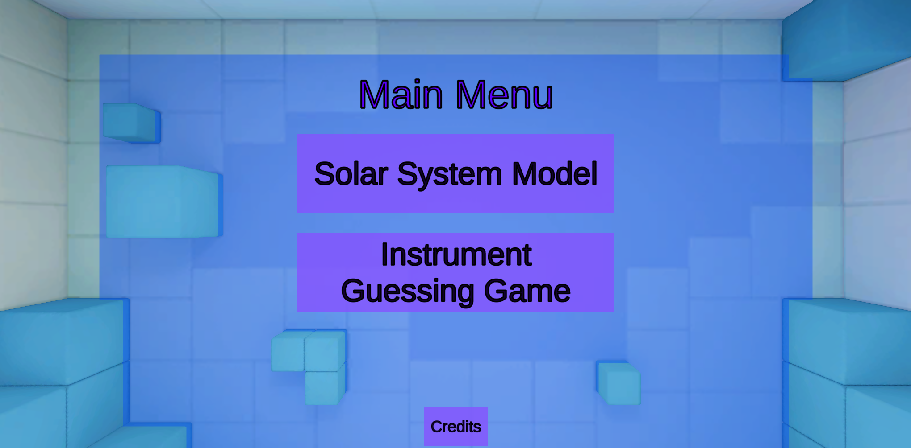
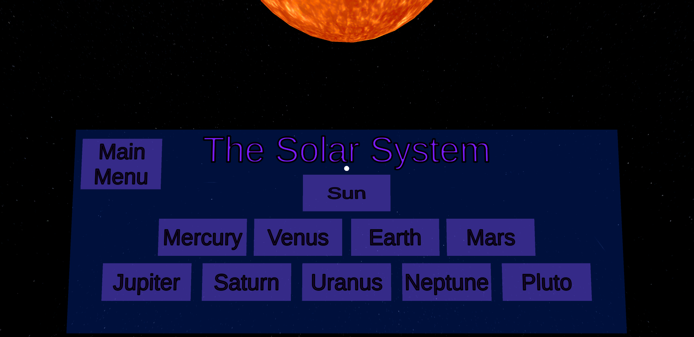
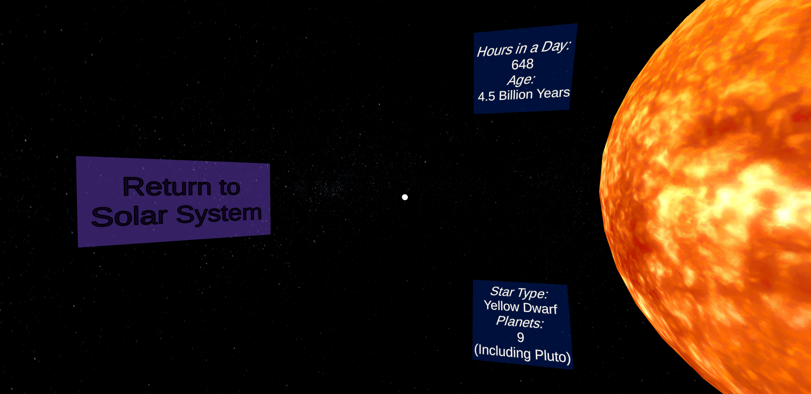

# Directions for Educator

K12VirtualReality_MainHub is an application containing a couple different experiences for learning in Virtual Reality.

Educational experiences included:
- Main Menu - Menu area for student to get acclamated to Virtual Reality and select their experience.
- Space - Shows the solar system with all the celestial bodies including their rotations, revolutions, and facts about each.

---
### Main Menu:

A place where the student is first introduced to the world of VR. It is a little box with some 3D assets and nice visual colors. In this room there is a selection board for the different experiences the students have available to them.

--- 

### Space:
A place where the student is placed above the solar system. They can view the solar system as the celestial bodies rotate on their axis and the planets revolve around the sun. Each planet is selectable from the point of view of the student. Selecting a celestial body will take them to a singled out view where they get a close up with that celestial body. There is a facts board around the student where they can read interesting facts and information regarding each body relating to the SOL and some extra cool facts thrown in.

There is a back button to return from the individual view of any one celestial body which will bring the student back to the solar system view. There is also a Home button from within the solar system view to return back to the main menu.

---

## Tools and hardware:
- Windows Operating system
- Android or iOS phone
- [Google Cardboard](https://arvr.google.com/cardboard/get-cardboard/) or similar device
    - Preferred a device with a physical lever that touches the phone screen.

## How to install:
- Android:
    1. Plug android phone into windows device through USB.
    2. Open android phone with File Explorer.
    3. Move to Downloads directory of android device.
    4. Copy APK file into Downloads directory.
    5. Inside the android phone, navigate to the Downloads directory and install APK file.
    6. Find on home screen or app drawer and play.

- Apple:
    - TODO
