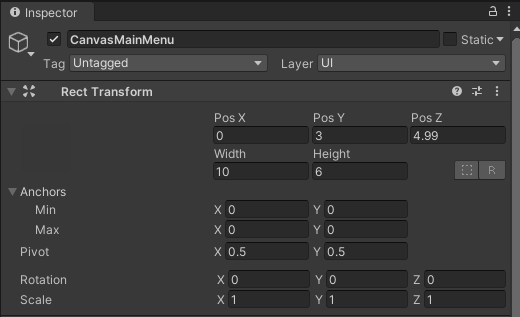

# Basic User Interface Creation
<b>NOTE: Getting Started instructions should be viewed before moving to this step. </b>

## Student Goals ##
- Learn the details involved in the creation and manipulation of basic UI elements in Unity
- Create a sample version of the Main Menu scene using these instructions
- Be able to build other UI's in Unity using the logic learned in these instructions

### Instructions ###
Naviagate to the HelloCardboard scene
#### Canvas ####
1. Right-click on a blank spot in the hierarchy and select Canvas from the UI menu. A canvas is a holder for UI elements in a scene similar to how an art canvas is a holder for a painting. You can double click on the canvas object (or any object) in the hierarchy to get a better view of it in the scene window.
2. In the inspector for the canvas object, under the canvas component, change the render mode from screen space to world space. This is necessary so that the canvas can be placed anywhere we like in the scene rather than just taking up the whole screen like a pause menu would in a traditional none VR video game.
3. Still in the inspector for the canvas object, remove the graphic raycaster component by right-clicking the component title and selecting remove component from the menu. Add the GvrPointerPhysicsRaycaster and GvrPointerGraphicsRaycaster components. Do <b>NOT</b> change the settings of these components. They are necessary so that the reticle can detect the objects and respond to them in game. Also, do <b>NOT</b> alter the Canvas Scaler component.
4. Using the Pos X, Pos Y, Pos Z, Width, and Height elements of the Rect Transform component to move the the canvas wherever you would like it to be in the scene. For instance, to allow for the best view, we chose to place our canvas just barely in front of one of the walls of the CubeRoom.
5. (Optional) Change the name of the canvas object so that it is distinguable from other canvases you may add to the scene at a later time.

  A sample canvas can use the following name and rect transform settings; however; you are free to use whatever position, dimensions, and naming scheme you prefer. 

#### Panel ####
1. Add stuff here
