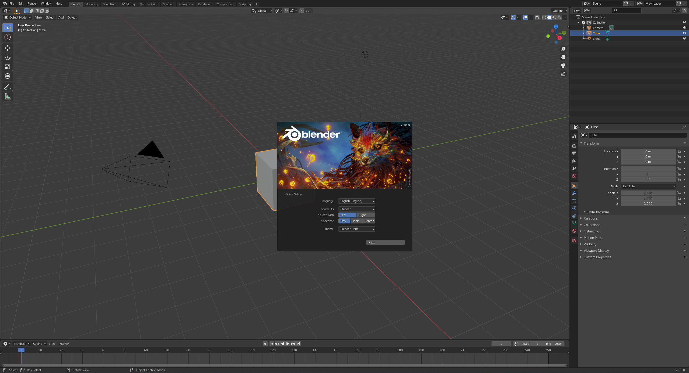

# Directions for Student

These directions will help you get started with re-creating the application you've seen and allow you to modify it to make it your own.

# Space Scene

## Getting Started

Before you can get started, you first need to install some software:

- [Blender](https://www.blender.org/download/) : 2D/3D modeling software (Windows/Mac/Linux)
- [Unity](https://unity3d.com/get-unity/download) : 2D/3D game engine used to make the project (Windows/Mac/Linux)
- [Visual Studio](https://visualstudio.microsoft.com/downloads/) : Editor to edit the code for our project.
- [Visual Studio Code](https://code.visualstudio.com/Download) : Alternative to Visual Studio if your computer can't run large, heavy programs.

Once you've installed the software, next you need to download some textures in preparation for the creation of the planets.

- [Textures](https://www.solarsystemscope.com/textures/) : Textures for each of the celestial bodies we'll be creating.
- [Moon](https://svs.gsfc.nasa.gov/4720) : Texture for the moon.
- [Pluto](http://planetpixelemporium.com/pluto.html) - Texture for pluto.

---

## Unity

After downloading Unity, you will install something called Unity Hub. Unity Hub is where you will controll all of your Unity Engine installs and projects.

Inside the Unity Hub, you will go to the Installs tab on the left and click the Add button. You will then choose Version 2019.4.* or higher and select all iOS and Android options when installing.

Next you will go to the projects tab and click "New" and select 3D Project. You can name the project whatever you'd like and make sure to select a Path for the project that you have access too. (i.e. C:/Users/\<Your User>/Documents/Unity Projects/).

Once you have created your project you should be greeted with this screen:

Next we need to add the Google Cardboard integration for our project.
We can do this by following [this](https://developers.google.com/cardboard/develop/unity/quickstart) link and following Google's directions very carefully!

Once we have the project set up with Google Cardboard integration then we are good to get started on making the Solar System.

---

## Blender

Blender is used to create the rings on Saturn as Unity doesn't have a built in model to create rings.

Once you download and install Blender, you'll be greeted with this screen:

---

## Visual Studio/Code

Visual Studio and Visual Studio Code are both editors that can be used to write code for the Unity game engine.
- Visual Studio is a more official IDE and contains intellisense for Unity projects, but is heavy and may not run on low end hardware.
- Visual Studio Code is a more lightweight text editor that can function as a full blown IDE with some extra extensions installed.

Examples of both look like the below images after install:

---

## Next Steps

