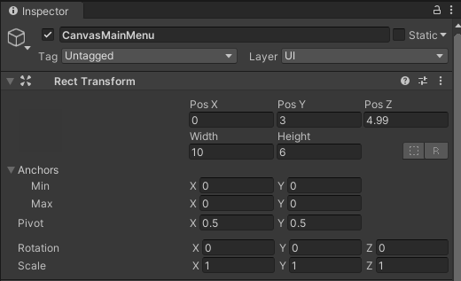
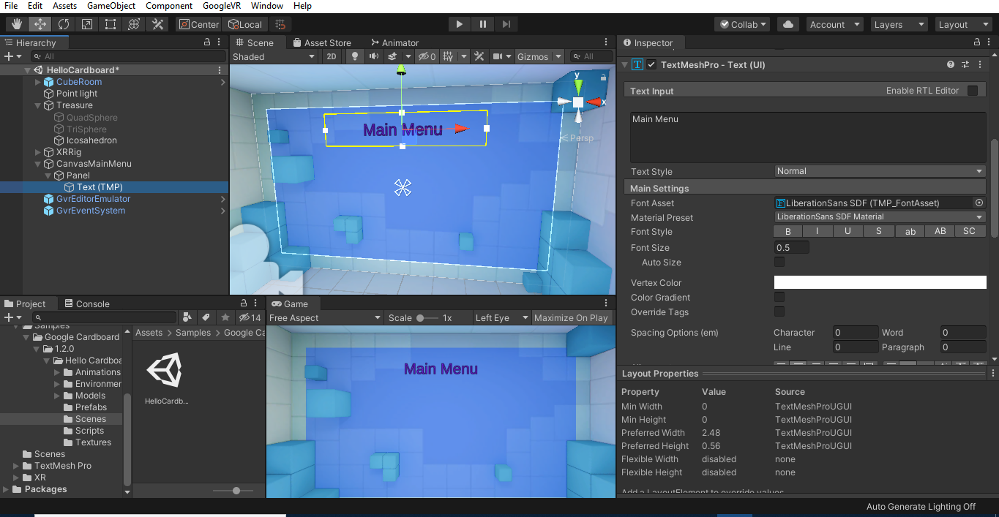
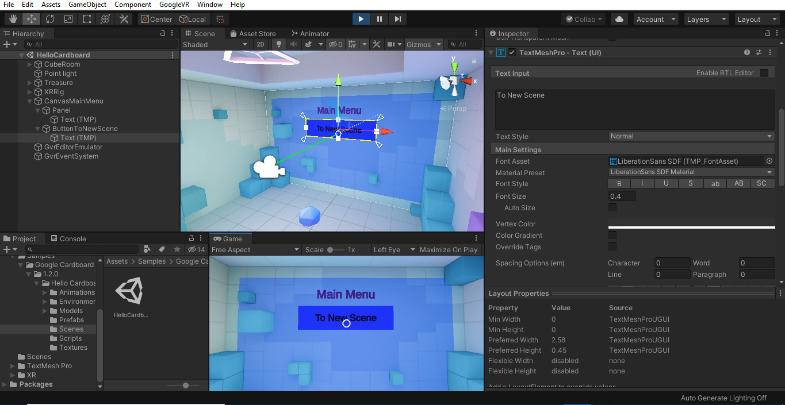

# Basic User Interface Creation
<b>NOTE: Getting Started instructions should be viewed before moving to this step. </b>

## Student Goals ##
- Learn the details involved in the creation and manipulation of basic UI elements in Unity
- Create a personalized sample version of the Main Menu scene using these instructions
- Be able to build other UI's in Unity using the logic learned in these instructions

### Instructions ###
Naviagate to the HelloCardboard scene
#### Canvas ####
1. Right-click on a blank spot in the hierarchy and select Canvas from the UI menu. A canvas is a holder for UI elements in a scene similar to how an art canvas is a holder for a painting. You can double click on the canvas object (or any object) in the hierarchy to get a better view of it in the scene window.
2. In the inspector for the canvas object, under the canvas component, change the render mode from screen space to world space. This is necessary so that the canvas can be placed anywhere we like in the scene rather than just taking up the whole screen like a pause menu would in a traditional none VR video game.
3. Still in the inspector for the canvas object, remove the graphic raycaster component by right-clicking the component title and selecting remove component from the menu. Add the GvrPointerPhysicsRaycaster and GvrPointerGraphicsRaycaster components. Do <b>NOT</b> change the settings of these components. They are necessary so that the reticle can detect the objects and respond to them in game. Also, do <b>NOT</b> alter the Canvas Scaler component.
4. Using the Pos X, Pos Y, Pos Z, Width, and Height elements of the Rect Transform component, move the the canvas wherever you would like it to be in the scene. For instance, to allow for the best view, we chose to place our canvas just barely in front of one of the walls of the CubeRoom.
5. (Optional) Change the name of the canvas object so that it is distinguishable from other canvases you may add to the scene at a later time.

  A sample canvas can use the following name and rect transform settings; however; you are free to use whatever position, dimensions, and naming scheme you prefer. 

#### Panel ####
1. Right-click on the canvas object in the hierarchy and select panel from the UI menu. Ensure that panel is a child of the canvas object. 
2. In the inspector for the panel object, click on the shape box in the rect transform component and select center middle. This allows us to move the panel wherever we like instead of just having it be dependent on the canvas object. Next, similar to what you did for the canvas, use the rect transform to set the position and size of panel. You can place it wherever you want. It does not have to be on top of the canvas; however, that is where we placed ours for the HelloCardboard scene.
3. Make sure the image component is checked and set the source image of the panel to None (sprite) by clicking the target looking identifier on the source image bar and selecting None from the menu that comes up. Make sure that the Raycast Target and Maskable boxes are checked in the image component.
4. Set the color of the panel to whatever you like. To get the exact color we used, use color code 0045FF with an alpha value of 100.
5. Next, add Text - Text Mesh Pro as a child of panel from the UI menu. Set the position, color, and actual text to whatever you like. We chose to use the text as an identifier of the scene by setting our text to say Main Menu and positioning it at the top of the panel. 

  This is what ours looks like up to this point; however, your project will differ in the position, color, and text you selected.  

#### Button ####
1. Add Button - Text Mesh Pro as a child of canvas but not of panel. It is recommended that you give your button a distinct name to distinguish it from other buttons that may be added in the future.
2. Follow steps 2, 3, and 4 of the Panel instructions with respect to the button. To copy our exact color for the button, use color code 8651FF with alpha 200.
3. In the inspector for the button, make sure the button component is checked. Make sure interactable is checked so that the button can be clicked, transition is set to color tint, and Target Graphic is set the button image. Target Graphic can be set by dragging the button object from hierarchy to the Target Graphic bar.
4. Leave the normal color as the original white. Set the highlighted and pressed colors to whatever you like. We used color code 1951FF with alpha 255 for the highlighted color and color code D951FF with alpha 255 for the pressed color.
5. Text (TMP) should have been automatically added as a child of the button object upon its creation. Select the child text object from the hierarchy and set the position and actual text to whatever you want. (<i>NOTE: The color will remain the same as previous text unless you change the material preset of the text or create a new material to apply to the text. Due to the challenge that both the options pose, they will not be covered in this tutorial.</i>)

  At this point, you can test the project by pressing play and seeing how the button and reticle react when you hover over the button and press the button. The button has no function assigned to it at this point. Action will be assigned to the button in later tutorials. Below is an example of what your HelloCardboard scene could look like at this point in game mode.  

