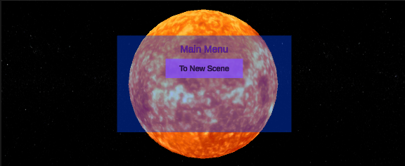
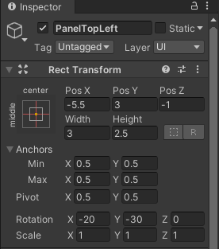
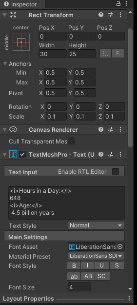
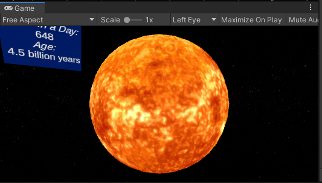
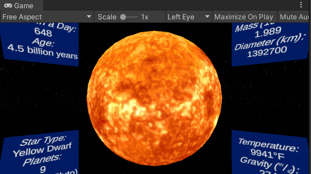

 # Space User Interface creation
<b>NOTE: Setup, Introductory UI, Scene Transition, Background Music, and Space Instructions should all be viewed before moving to this step. </b>

## Student Goals ##
- Add a user interface to each planet scene
- Add a user interface to the broad solar system scene
- Understand the use of buttons and materials in relation to text color in Unity
- Generalize UI logic to use in other instances in Unity projects

### Instructions ###
An example of one scene will be created in this tutorial. You will be expected to develop the other scenes based on the same logic.
#### Individual Planet / Star Scene ####
Navigate to your desired starting planet or star. For the sake of this tutorial, we will use our Sun scene.
1. In the Sun scene, all that should be present in the hierarchy at this time are the XRRig camera, the sun object with proper material applied, 
the GvrEventSystem prefab, and the GvrEditorEmulator prefab. From the HelloCardBoard scene, copy and paste in the SceneChanger game object and all its children 
and the SceneChangerScript game object. Don't worry that the Canvas looks weird now as we will change this drastically during this tutorial; however, 
it provides a good baseline to start making our changes.
2. Change the SceneChanger game object to a location where you can see the Canvas in front of the camera and in front of the planet or star. The actual numbers will depend upon your XRRig location and planet size. You should only need to change the X, Y, and Z position values for this step. These values can be changed later if needed; this is just to get the Canvas into view so that we can see the changes we make to our scene. <i>Note: You may also need to adjust the position of the Black Fades Images game object as it can sometimes move off of the camera when changing the value of the SceneChanger game object.</i>

  Your scene should look similar to this image at this point.  

3. The first thing we will do is set up the button to get back to our main solar system scene. We can do this easily by just changing the existing button. Change the button name and button text to represent its new purpose such as Button to Solar System. Don't forget to change the dimensions of the button to account for this new text and to change the desination scene that the button will take you to when pressed.
4. Next we will change the position of the button. What makes this process easier is that even though a Canvas is required to display UI elements, UI elements do not have to be flat against a canvas or panel. This means that we can rotate or change the X, Y, and Z values as we like without having to create a new Canvas. Change the position and rotation of the button so that it is visible when the user turns their head 90&deg; to the left.
5. Next, we will be modifying our panel to display some facts about the sun. Rename the Panel to PanelTopLeft so that we can distingish it from other panels we will add to the scene. Change the position of the panel to put it at the top left side of your planet and rotate it so that it faces the camera. Feel free to change the color and transparency of the panel to your liking. 

  The values for this will again depend upon your camera location and planet size; however, to try and provide some guidance, these are the values we used for our top left panel.  

6. Now we will add some facts to our panel. As stated in the Introductory UI Instructions, to just change the color of the text here would change the color of the text in all scenes we have so far as we would be changing the color of the material itself and not just the text in this instance. To solve this, you could create a new material from scrath if you wanted; however, we found that the TextMeshPro material had a simplier alternative. Select the Text (TMP) child of the PanelTopLeft game object, and in the inspector under the TextMeshPro component, locate the Material Preset drop down and change it from LiberationSans SDF - Material to LiberationSans SDF - Outline. This will allow us to use the same text setup while also applying a new color scheme. You can now locate the LiberationSans SDF - Outline Shader in the inspector and change the Face and Outline color to whatever you wish.

7. Now that our text is a nice color, we change the size, position, and style of the text. Again, the position, size, and text itself will depend upon your previous settings. You panel size may need to be altered to accomidate for your text size. It may take some trial and error to find the proper alignment

  These are the settings we used for the PanelTopLeft text. Notice the Width, Height, Scale, and Font Size values have been altered. The i and /i in brackets are syntax to indicate that the text between the brackets should be in italics. Feel free to look up common HTML text formats to apply your own style to your text.  

  The scene will now look similar to this image. This is a stationary preview of the Game window so even though the top left panel is cut off in the preview, you can see it when playing the game and looking around. Also, keep in mind you can not see the back to Solar System button in this image but it is present off to the left side.  

8. You can now create the remaining PanelTopRight, PanelBottomLeft, and PanelBottomRight game objects by right-clicking the PanelTopLeft game object, duplicating it, and changing the name, position, rotation, and text as needed. You shouldn't need to alter many values to make these changes. If you get lost, you can always deleted the duplicated game object and start again.

9. The last panel to add is the fun facts. Again duplicate the PanelTopLeft game object and rename it to PanelFunFacts. Change the position, rotation, and text size and content to provide fun facts about your planet below and angled up at the user's initial point of view. Hint: We duplicated the text child here to have one be the heading and the other be the facts themselves.

  You game window should now look similar to the image with the button and fun facts panel out of view until the game is played.  

10. Create an empty game object name FactPanelHolder and make it a child of the Canvas. Drag all the fact panels to be children of the FactPanelHolder game object. Like before, you can paste the SceneChanger game object into each new planet scene you create. Since all of the fact panels have been made children of one object, you can simply change the position of the FactPanelHolder game object in each new planet scene around your planet instead of altering each individual panel itself. As long as you do not change the name of the Canvas or Black Fades Images (or any other variables you add to the animation), copy and pasting the SceneChanger game object will always play the animations correctly.

  We will leave the main solar system scene UI to you as a learning exercise. Hint: You should start by copying the HelloCardboard scene SceneChanger game object. You will want to copy that one instead of the altered version created in this tutorial so that you won't have all the planet specific panels to deal with. From there just alter the panel how you wish, add desired text, and add a button for each planet scene that you need to transition to.

Congratulations on completing you Unity Space Project!
