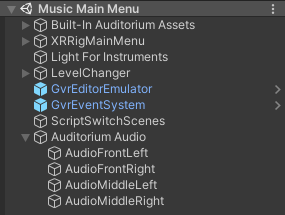
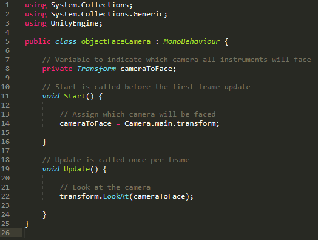
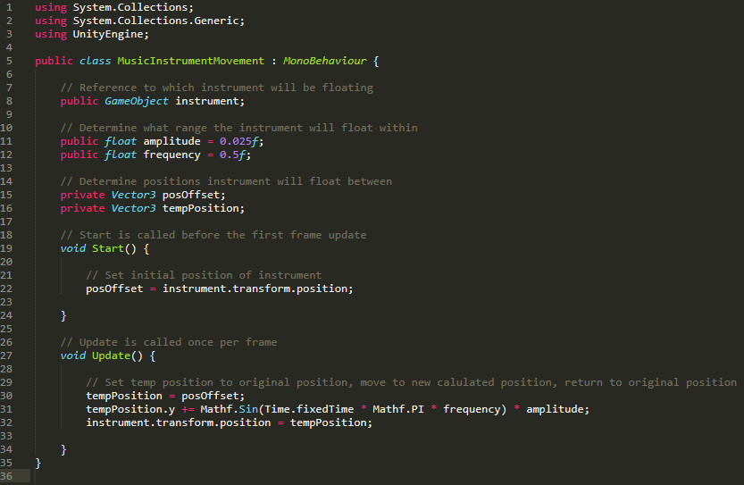
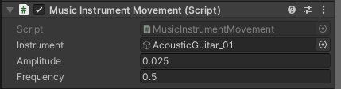

# Directions for Music Scene Set Up

## __NOTICE: This section assumes you have fully completed the General Setup and All Space Instructions.__

## Getting Started

After completing the General Set Up Instructions and the Space scene, you should have a general idea of how Unity works.  
We will now move forward to creating the Music scene, which provides a few extra challenges. The instructions will be more open ended from here to help teach you one of the most important things a programmer can learn: how to teach yourself. Don't be afraid to research things you don't understand at the moment; this is an important part of the learning process.  

To begin, we must acquire all assets required from the Unity Asset Store. For our case, it is better to use premade assets as creating these ourselves would be another project in itself.

Assets Used: 
- [Auditorium](https://assetstore.unity.com/packages/3d/environments/auditorium-141127) : All Auditorium Assets
- [Instruments](https://assetstore.unity.com/packages/3d/props/stylized-musical-instruments-pack-176502) : All instrument prefabs

Download and import these assets into Unity. If you have problems during importation, consult Unity documentation online.

<i>NOTE: These assets are not free. If free assets are needed, explore the Unity Asset Store and find suitable alternatives.  
The Auditorium asset is simply an environment to use; any free environment will work fine.  
The instruments were the most concise pack we could find; free instruments will work here as well.   </i>

## Setting Up the Environment

We will now set up the Auditorium Environment. If you used a different environment, tailor all instructions to fit your assets as best as possible. This leaves you room for creativity.

1. In the Project Window, find the Auditorium Asset Folder, find the Auditorium scene within, and press CTRL+D to duplicate it. This will create a new scene, Auditorium1. Change the name of Auditorium1 to Music Main Menu and open it.
2. In the Music Main Menu hierarchy, create an empty game object called Built-In Auditorium Assets and drag all existing elements in the hierarchy to be children of the Built-In Auditorium Assets object. This will us help clean up our hierarchy quite a bit. 
3. Follow General Set Up and Space Instructions to set up the camera, reticle, canvas UI, and scene changing script (You will not have a button to attach this script to yet.)  
<i> (Hint: You can copy and paste all of these elements in from the Main Menu Scene, change the UI as needed for the next instructions, and update the destination for the scene changing script in Unity when the time comes) </i>  
Position the XRRig camera in front of the stage in a way that looks pleasing to you. We used X: -0.3, Y: 0.5, and Z: 6.
4. To brighten up the stage a little, create a directional light above the middle of the stage and name it Light for Instruments. You shouldn't have to change any Inspector settings besides the X, Y, and Z location values.

5. Create an empty game object called Auditorium Audio. Create four empty game object children named AudioFrontLeft, AudioFrontRight, AudioMiddleLeft, and AudioMiddleRight and add an audio source component to each. Move each game object to be place over the Auditorium speaker for which it was named within the scene. For example, the AudioFrontLeft object goes over the speaker on the front left of the stage. For all audio sources, in the inspector, uncheck Loop, change the Spatial Blend to 3D, and set the Stereo Pan to either left or right depending on the game objects location in the scene with respect to the camera.

6. Using the existing SceneChanger game object, alter it so that only the button and black fade images remain under the canvas object. Move the button so that is it up against the back wall and facing the correct way. Change the text to "Exit" and set the button to work with the scene changing script and to go back to the Main Menu Scene when clicked. You can change the button color and text color to whatever you like; however, you <b>MUST</b> create a new material to use for the text color (just duplicate and change the name of the existing one) or you will change the text color for everything in the project.

Your hierarchy should now look similar to this, though naming conventions may vary for the SceneChanger object and the switching scenes script object.  

7. Now make sure that we can reach the new scene we have created. Return to the Main Menu scene and add another button Under the Solar System Model button that says Instrument Guessing Game and set the button to change to the Music Main Menu Scene when clicked. You should now be able to navigate back and forth between the Main Menu and Music Main Menu scenes.

More will be added to the Auditorium as you progress through the project. Next, we need to add the instruments.

## Creating Instrument Prefabs
 We will now align each instrument correctly to work in the environment. Unfortunately, this will be the most tedious part of this project. We promise everything is fun after this so stick with it!
 
 1. In the Project Window, find the Instruments Asset Folder and open the Prefabs folder within. Drag the first instrument, the AcousticGuitar_01 into the scene. Location is not immediately important right now as we are focusing on the angle and presentation of the instrument first; however, location will need to be altered after proper presentation is confirmed so that can there are no errors with the spawner in future instructions. Do <b>NOT</b> edit the name of the prefab.  

<i><b>NOTE:</b> Some of the following instructions may not apply to your instruments if you used different instruments than ours. Read steps 2 and 3 first carefully to see what changes need to be made to your instruments. The creation of the new parent game object should be done regardless to avoid confusion with our instructions; however, some rotation values that we give our instruments may not be necessary for your instruments. </i>  

2. Adjust the rotation value of the guitar so that it sits up at a proper angle similar to how ours looked in game. This can be tricky, so we will give the values used for the Acoustic Guitar. For position, use X: 0, Y: 1, and Z: 0. For rotation, use X: -70, Y: -180, Z: 0. These values will change with each instrument, explore and see what looks best for each. Note that the instrument appears to be backwards right now, the reason for this will be addressed shortly.
3. Next, create an empty game object called Acoustic Guitar, and move the AcousticGuitar_01 to be a child of the new game object. Again, the position values are not currently relevant; however, to work properly with the spawner, the position values of the newly created Acoustic Guitar game object must be set to X: 0, Y: 0, and Z: 0. Set the rotation to X: 0, Y: 180, and Z: 0. If done correctly, you will see that the instrument is now facing the correct direction. The values of the parent game object should be the same for every instrument you create. 

<i><b>So why did we do it this way instead of just having the original AcousticGuitar_01 face forwards?</i></b> 
When you play the finished game, instruments spawn in three different locations on the stage, and each instrument faces the camera regardless of its spawn location. The fact that the instruments face the camera, no matter their location in the scene, is reliant upon a script we will create that uses the Z axis of the instrument to determine the instruments "front". If you examine the original AcousticGuitar_01 prefab, you will see a blue directional arrow that points outwards down the fretboard of the guitar. This blue arrow represents the Z axis in Unity. If the objectFaceCamera script was placed on this prefab directly, then Unity would consider the head of fretboard the "front" of the instrument and this is what would face the camera. Obviously, that's not what we want, so we had to come up with a solution. Hence, the parent game object.  

With the alignment of the AcousticGuitar_01 instrument and the creation and alignment of the parent Acoustic Guitar game object, we can change the direction that the Z axis points and determine our own "front" of the instrument. For instance, with the parent Acoustic Guitar game object selected, the Z axis should now point straight out back at the user, the logical "front" of the instrument.

4. Now let's make the script that causes the instruments to face the camera, regardless of their spawn position. With the parent game object selected, add a new script component and name it objectFaceCamera.  

Use the following script:  

When you enter game mode now, the "front" of the object should face the camera, regardless of its position in the scene. Be sure to test this before moving on. It's better to fix one instrument now than fix all the instruments later. 

5. With the parent game object still selected, add an audio source component and make sure "Play On Awake" and "Loop" are both <b>UNCHECKED</b>. For now, this will serve as a placeholder, The audio file will be added at a later time.

The Transform, objectFaceCamera script, and the Audio Source should be the only components attached to the parent game object.

6. Select the child prefab, AcousticGuitar_01. Add a new script component and name it MusicInstrumentMovement. This script will be used to give each instrument the hovering effect seen in-game.  

Use the following script:  

The numeric values for amplitude and frequency have been preset in the script; however, they are public values so you may change them dynamically in Unity if you wish to experiment with other values. Drag the AcousticGuitar_01 prefab from the hierarchy to the Instrument box in the inspector for the script to indicate which object will be controlled by the script.

The inspector for the script should look similar to the image below.  

7. We are now ready to the Acoustic Guitar as a prefab for our own use. Pick a good spot in your project window and create a Prefabs folder, within the prefabs folder, create an Instruments folder. Select the parent game object, Acoustic Guitar, and ensure the position values are all set to zero. Select the child prefab, AcousticGuitar_01, and ensure the position values of the X and Z coordinates are set the zero. The Y value will change depending how far you want the object off the ground. We used Y: 1 for the Acoustic Guitar. The position of the instrument in the scene will be controlled by the spawner in the future; therefore, the position values on the prefab itself need to be zeroed as such to avoid unexpected errors in game. Select the Acoustic Guitar parent game object from the hierarchy and drag it into your Prefabs>Instruments folder in the project window. You can now delete the Acoustic Guitar game object and the AcousticGuitar_01 prefab from the hierarchy as we now have a saved reference prefab of them in our Prefabs>Instruments folder. 

<i><b>NOTE:</b> Make sure the new prefab is present in the Prefabs>Instruments folder before deleting it from the scene or you will have to start over.</i>

8. Now comes the part we warned would be tedious. Repeat steps 1-7, as needed, for each instrument you wish to use in your game.  
 
You will notice that some instruments that came with the Unity Asset Store Instrument pack are not present in our game. You are free to pick whichever instruments you want to use for your game. You will also notice that some of the instruments we used in our game are either not in the default pack, like the snare drum, or are missing parts in their default states, such as the DJ mixer not having headphones, the drums not having drum sticks, or the cymbals being only a single cymbal. You can use the instruments in their default states if you wish, or if you want a little extra challenge, you can make the instruments look like ours. We will leave this to be a creative task for you. 
<i>(HINT: Multiple instruments/other empty game objects can be children of the parent game object to create a new prefab. Make sure to layer instruments and game objects correctly so that they work with your scripts.)</i>  

9. Once all of your other instruments are saved as prefabs, we can create outlines to be used for the other scenes in the music project. Duplicate the Music Main Menu scene twice and name the results as follows: Finite Game and Gallery. Change the Exit buttons in the new scenes to point back to the Music Main Menu scene rather than the general Main Menu scene. <i><b>NOTE:</b> There will eventually be an Infinite Game scene present as well; however, it is easier to set up the spawner once in the Finite Game scene and then Duplicate it to create the Infinite Game scene than it is to do that work twice.)</i>

You should now have three basic auditorium scenes: Music Main Menu, Finite Game, and Gallery, buttons that take you back to the Main Menu or Music Main Menu scenes, respectively, and prefabs for all instruments you wish to use in game in your Prefabs>Instruments folder. This will serve as our foundation for the music project. We are now ready to move on to more buttons and game logic in the next tutorial.
