# Directions for Music Scene Set Up

## __NOTICE: This section assumes you have fully completed the General Setup, all Space Instruction and the Music scene setup instructions.__

## Getting Started
After completing setup for the project as well as the setup for the Music scene, we want to add the ability to:

- Spawn three instruments on the stage.
- Pick one correct instrument
- Add the ability to select an instrument
- Compare the instrument selected to the previously set correct instrument.
- Play the set correct instrument every few seconds as a hint to the player
- Set the score on the scoreboard

For this project, we have two different game modes: **Infinite** and **Finite**. The code for both modes is very similar though there is one core difference. The infinite game mode will continuously cycle through the list of instruments forever therefore there is no need to have a round counter, unlike the Finite game mode where there are a finite set of rounds before the game is over.

Each game mode has a scoreboard to display the number of correct guesses vs incorrect guesses and for the Finite game mode only a spot for the round count.

We will show you how to create the finite game mode in this documentation, in order to make the infinite game mode you will just duplicate the instructions and remove any reference to the variables and code for the current round counter. 

## IMPORTANT: Do NOT attempt the Finite scene Infinite scene until you have the completed these instructions and the following Animator Instructions.

**Finite:**
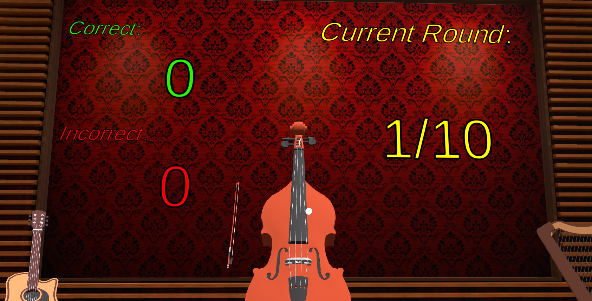

**Infinite:**
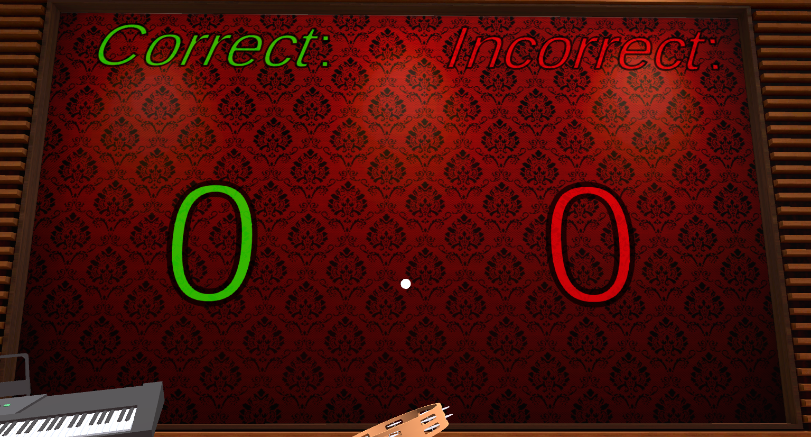

## Creating the Game Objects

To begin we want to create the game objects in unity that we will need.

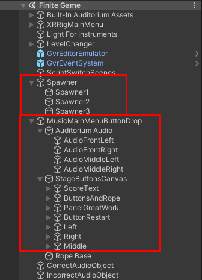

We will first create an empty game object and call it "Main_Spawner". This spawner will contain the three instrument spawners as well as the script for all the game logic. Since this Spawner game object will be an empty game object, it doesn't matter where it is put in the scene. We decided to put it here:

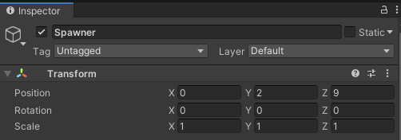

Next, we will create all the individual instrument spawners which are three empty objects called "Spawner1", "Spawner2" and "Spawner3" (left to right on the stage respectively). The three positions we have set for these spawners are as follows:

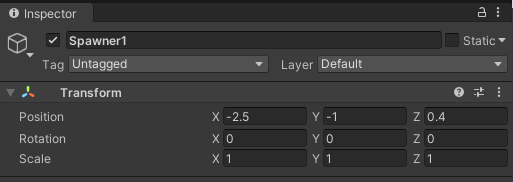
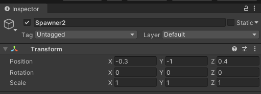
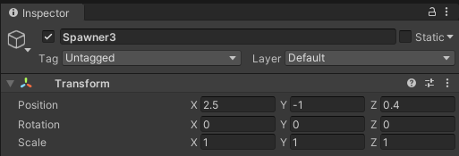

Next, we will create all the speakers for the audio to play when a correct instrument is selected. There will be four audio sources to match the two speakers on stage as well as speakers to the left and right of the player. The image below shows where to place the audio source game objects:

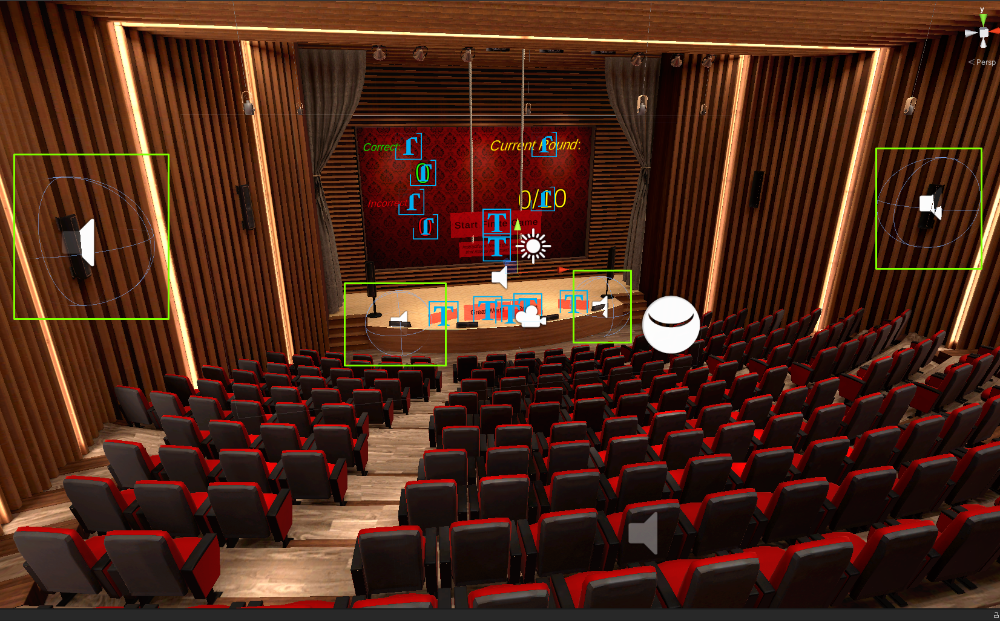

Next, we want to create the Buttons for the player to be able to select the instruments when they spawn. Therefore, we will create a Canvas for the scene and call it "StageButtonCanvas." Under the canvas create three "Button - TextMeshPro" buttons and name them "Left", "Middle" and "Right" respectively. Your Hierarchy should look like this:

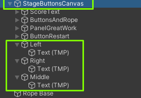

After setting your font size of the button text to the correct value (For us it was 0.1), make sure to place the buttons like so:

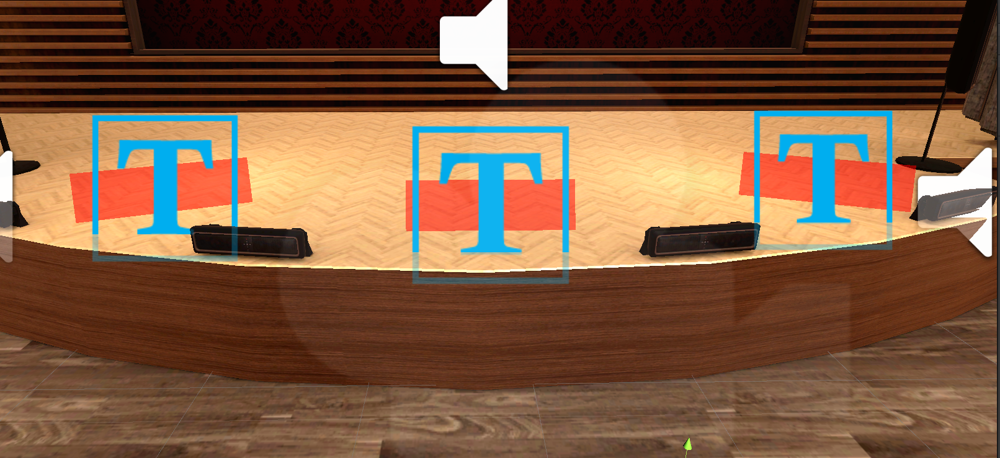

Finally, we will create the scoreboard text objects. To start we will create a new Panel that we will set all the text onto. This panel will be under the "StageButtonsCanvas" object we created earlier. Under the new panel we will call "ScoreText" we will create a few different "TextMeshPro" objects that contain the titles for Correct and Incorrect score as well as Current Round. We will also have a few for the actual scores and current round count.

Your Hierarchy should look like so:

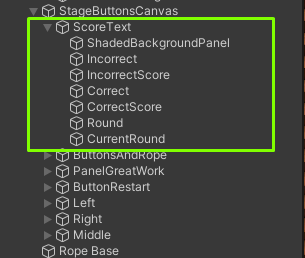

Your scene should look as follows after moving all the text objects and panel objects to the correct positions:

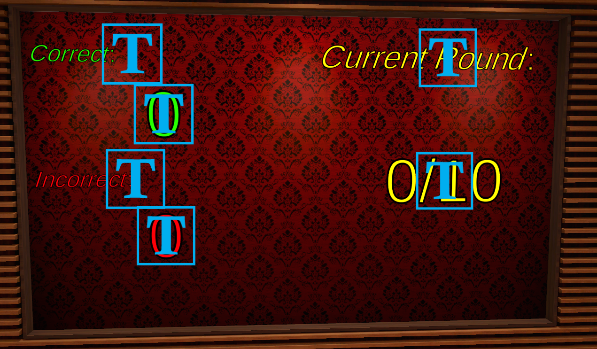

That should be it for the game objects that need to be created. From here on we will focus on writing the game logic code in a new script!

## Writing the code

Before we get into the code, we first need to create the script that allows us to play the game. Make a new script called "FiniteSpawner.cs" and open it up in a code editor like Visual Studio.

We need a way to access all the different parts of the scene to control what happens to them during the game. So, to do this, we will create a bunch of class variables that we will drag and drop the various scene objects into.

You will notice some red outlines of certain code bits and that is to specify that bit of code is specific to the finite game mode.

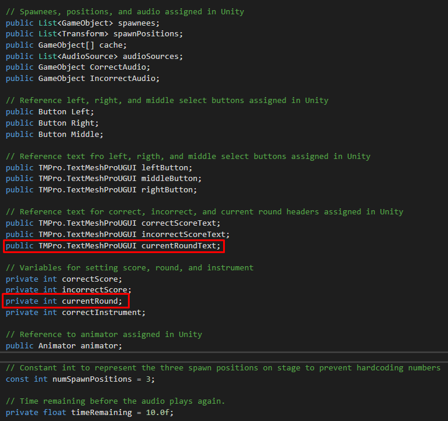

### Public Variables:

- **List<GameObject> spawnees** -- List of GameObjects we want to pick from to spawn in the scene.
- **List<Transform> spawnPositions** -- The spawn positions of the different spawners in the scene (Left, Middle, Right).
- **GameObject[] cache** -- A cache array to hold the three music instruments that are currently spawned and in the scene.
- **List<AudioSource> audioSources** -- The Audio sources in the scene that will play the audio of each correct instrument.
- **GameObject CorrectAudio** -- The Audio that plays when the player selects the correct instrument.
- **GameObject IncorrectAudio** -- The Audio that plays when the player selects the incorrect instrument
- **Button Left** -- The Left button for selecting the left-most instrument.
- **Button Right** -- The Left button for selecting the right-most instrument.
- **Button Middle** -- The Left button for selecting the middle-most instrument.
- **TMPro.TextMeshProUGUI leftButton** -- The text part of the left button for setting the name of the button to the spawned instrument.
- **TMPro.TextMeshProUGUI middleButton** -- The text part of the middle button for setting the name of the button to the spawned instrument.
- **TMPro.TextMeshProUGUI rightButton** -- The text part of the right button for setting the name of the button to the spawned instrument.
- **TMPro.TextMeshProUGUI correctScoreText** -- Text for the correct score count.
- **TMPro.TextMeshProUGUI incorrectScoreText** -- Text for the incorrect score.
- **TMPro.TextMeshProUGUI currentRoundText** -- Text for the current round.
- **Animator animator** -- The animator to manage the transitions.
  <b><i>NOTE:</b> You can comment out the animator variable at this time. It will be implemented in the next set of instructions.</i>

### Private Variables:

- **int correctScore** -- The variable that holds the correct score.
- **int incorrectScore** -- The variable that holds the incorrect score.
- **int currentRound** -- The variable that holds the current round.
- **int correctInstrument** -- The variable that holds the correctInstrument value.
- **const int numSpawnPositions** -- The number of spawn positions available.
- **float timeRemaining** -- The time remaining in the timer to play the audio in loop.

### Start method:
In the start method we want to set the "correctScore" variable to zero as well as "incorrectScore" and "currentRound" since we haven't started the game yet. We will instantiate the cache array with a size of three since we will be spawning three instruments per round. And finally, in order for the game to be a little random, we will shuffle the instrument order by calling a function we will create further in the directions.

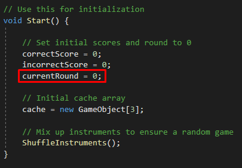

### Update method:
The update method runs every frame of the game so it is the best place to put our timer for playing the correct instruments audio. First, we check if a correct instrument is selected, if not we just exit the functions. Assuming a correct instrument is selected, we will check the time remaining. If the time remaining is still greater than Zero then we will subtract the time since the last frame. Once the timeRemaining has fallen below zero then we will reset the timeRemaining to ten seconds and play all the audio sources in the array. We will figure out how to set the audio for each source in a method later in the directions.

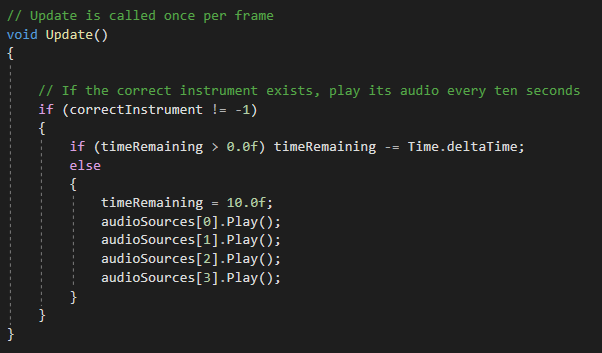

### UpdateScore method:
The UpdateScore method takes in an integer value that contains the value of the selected instrument. We get that value from the value we set on the button in the scene. An image of this is shown below:

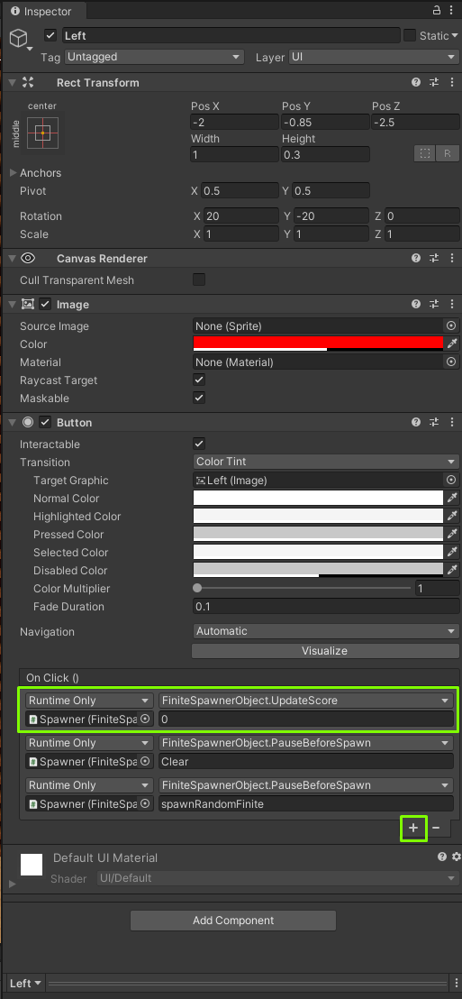

As you can see in the image, for the left button we send the method a 0 to this method if the left button is selected.

So, the first thing we do in this method is Debug.Log(value) to see the value that was passed, this allows us as the programmer to see if we are passing the correct value or if a value is being passed at all. Next, we will set the ButtonControl to off (Another method we will get to further in the directions) and we will check the value passed in to the value of the correctly selected instrument. If they match then we will increment the correct score, set the correct score text and set the audio clip for each audio source in the scene to the correct audio clip. Otherwise, we will increment the incorrect score, set the incorrect score text and set the Incorrect audio clip. Finally, we will set correctInstrument to -1 to signify to the timer that it no longer needs to count down.

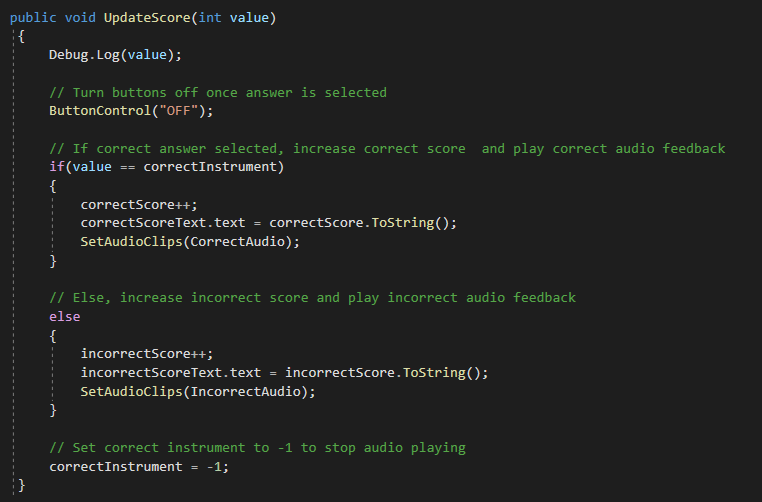

### SpawnRandomFinite Method:
This method will actually spawn the instruments on the stage.

First, we need to do a check to make sure the List of instruments is not empty. This is because after each round, the previously used instruments are removed from the List so that they don't show up twice in a game. If the List is empty then we must have reached the end of the game and so we need to turn the ButtonControl off.

Next, we make sure that the ButtonControl is on and we loop through each of the spawn positions, setting the instrument in the cache array to an instantiated game object of the instrument first in the List. Then we remove the instrument in the front of the List.

Next, we call SetButtonNames() to set the button names correctly, SelectCorrectInstrument() to correctly determine which of the three instruments is going to be the correct answer for this round and finally SetAudioClips(cache[correctInstrument]) passing the correct instrument in order to set the correct audio clip to each of our audio sources in the scene. **Note**: We will get to the aforementioned methods further in the directions.

Lastly, we increment the current round and set the current round text.

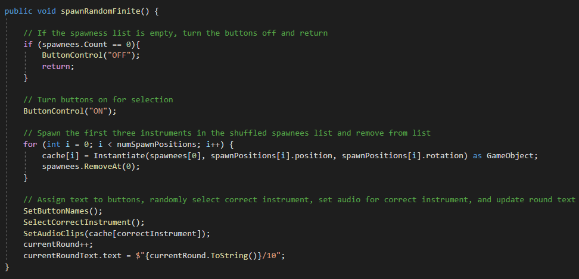

### SetButtonNames Method:
Each position on the stage has an instrument spawned in it. We want to set the button text to the name of that instrument and that is what this method does. It sets the text field of each button to the returned value of the GetNameWithoutClone method. (The next method in the directions)

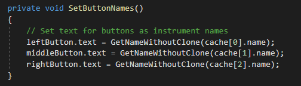

### GetNameWithoutClone Method:
When we instantiate a GameObject in Unity it automatically appends "(Clone)" to the end of the name.

i.e. If we instantiated an object titled "Map" then Unity would name it "Map(Clone)" once instantiated.

So, what we do is we split the string by the '(' character and take the beginning part of the string, giving us just the name of the object we spawned.

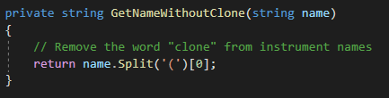

### SetAudioClips Method:
This method will set the audio clip of all the audio source objects in our scene.

First, we want to do another Debug.Log(obj.name) to see that the correct instrument is being sent to set the audio sources.

Next, we grab the audio clip attached to the instrument object passed to the method. Then we loop through each of the audio sources in our array and set the audio clip. Finally, we play the audio clip once for each audio source.

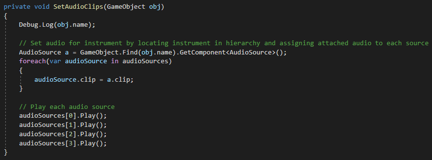

### ShuffleInstruments
This method will use C#'s LINQ library to re-arrange the List of instruments in a random way to make the game less repetitive.

We Order the List by a random seed and re-cast the value to a List.

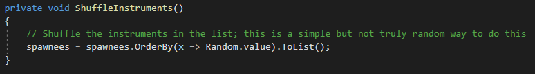

### SelectCorrectInstrument Method:
This method will select a random integer between 0 and 3 exclusive and set it to the correctInstrument variable.

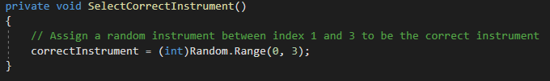

### PauseBeforeSpawn Method:
This method determines the correct method to call with the correct delay after each round. If we pass "Clear" it will clear all the data from the scene, if we pass "spawnRandomFinite" then it will spawn another round for the game. Each method we use a delay of two seconds.

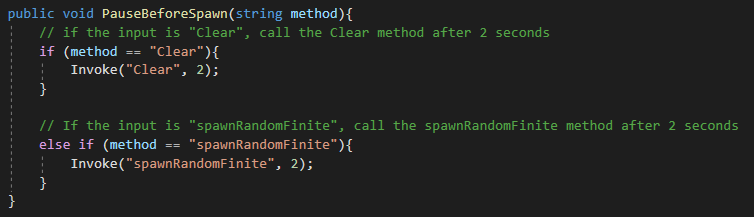

### ButtonControl Method:
This method will set the interactable value of each button to either true or false if we send the commands "ON" or "OFF" respectively.

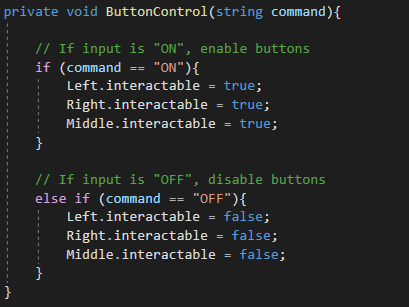

### Clear Method:
This method clears out the values from the scene.
First, we loop through all the audio sources and set the audio clip for each to null.
Then we loop through all the cache objects, destroy them and set them to null.
Finally, we check that the List of instruments is zero and if it is we play the FiniteGameEnd animation.  
<b><i>NOTE:</b> The conditional statement for the FiniteGameEnd animation can be commented out at this time to avoid errors. It will be implemented in the next set of instructions.</i>

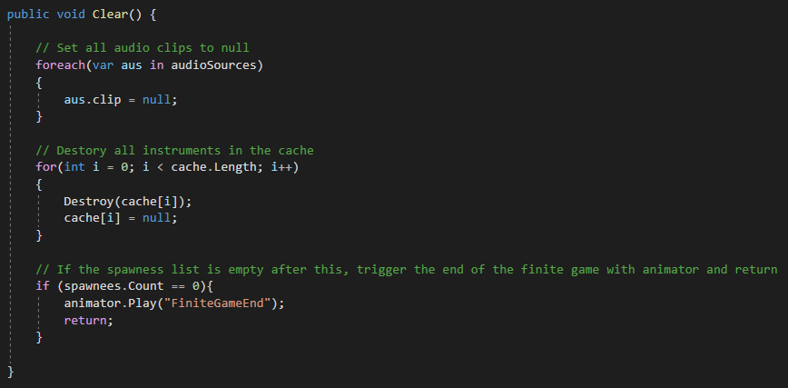

## Attaching the script to our Main_Spawner Object:
Finally, the last step is to attach the script to the Main_Spawner game object we created and click and drag all of our GameObjects from our scene to the script. The Main_Spawner script should look like such:

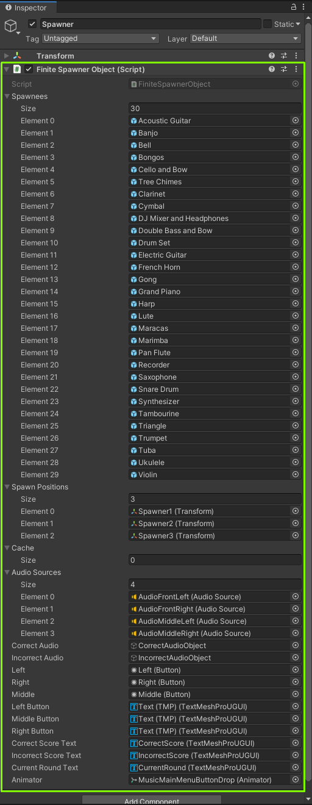

In order to fill the List of Spawnees we just drag and drop all the Instrument prefabs to into each element slot of the script.

## Finish
Once you have populated the parts of the script that are necessary then you should be able to run the game and see the finite mode running, counting each correct, incorrect and round the player plays.
