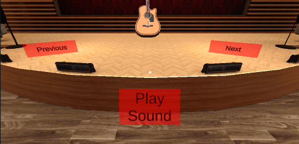

# Directions for Gallery Scene

## __NOTICE: This section assumes you have fully completed the General Setup, all Space Instructions, and all prior Music instructions.__

## Getting Started
This is the last scene we need to work on for the music project. These instructions will contain open-ended guidelines; however, most of this scene's technical details will be left as a challenge for you.

### Creating the spawner
1. You will start by creating a spawner just like you did for the Finite scene creation. The only difference this time is that you will only have one spawn location in the middle of the stage as we will only spawn one instrument at a time. Ensure that you have both the parent Spawner object and the child Spawner Location object.
2. Position your spawner in such a way that is far enough away to still be on the stage but close enough to see the instrument clearly. <i>HINT: You can drag some of the instrument prefabs into the scene and change their position to find what position looks best to you. You will then delete these prefabs from the scene afterwards and use the position values you liked for them for your spawner.</i>  

Code will be added to this object later in these instructions.

### Adding (Editing) the Buttons
3. Now that we have our spawner location, we can create the buttons that will surround the spawned instrument. Copy and paste in the MusicMainMenuButtonDrop game object and all children into this scene from the Finite game scene. Delete the following children of the MusicMainMenuButtonDrop game object: ScoreText, PanelGreatWork, and ButtonRestart. 
4. Rename the Left button to Previous Button, the Middle Button to Play Sound Button, and the Right Button to Next Button.
5. Change the position and text content of the Previous, Play Sound, and Next buttons to match how they look in our game. Remove the current method actions from these buttons; new actions will be assigned after the code is created.  

An example of how our buttons are positioned is shown below: 

6. Next, edit the Start button and instructions panel to state information relevant to the Gallery scene. Remove the current method actions from these buttons; new actions will be assigned after the code is created. This will be assigned to work with the previously created animations later on. For now, you can move the RopeAndButtons object to the objects raised position so that it is not in your way.

### Adding the Instrument Description UI
7. We can now add the Text Descriptions for each instrument. Start by creating an empty game object and name it DescriptionText. This will serve as a holder for all text objects.
8. In order to have our text stand out more, we chose to add a mostly transparent black panel over the red area of the back stage wall. This was purely a style choice; therefore, you may choose to do the same or not.
9. Create 4 text objects and name them as follows: InstrumentNameText, InstrumentFamilyText, InstrumentOriginText, and InstrumentFunFactText and make the text content "Instrument:", "Family:", "Origin:", and "Fun Fact:", respectively. Position each text object on the panel in a way similar to ours that allows room for descriptions for each instrument to be displayed and for the instrument itself to take up a good portion of the middle of the panel.
10. Next, as a child of the panel (or not if you did not create a panel), create another text object and name it InstrumentDescriptionText. Ensure that this text box is large and positioned in such a way that it covers enough of the panel to overlay the Text Headers already on the panel. You can use sample text to test different positions and font sizes, but ultimately, this text content will be left empty to allow dynamic assigning of text descriptions at the location of this text description.  

An example of how your hierarchy and scene should look at this time is shown below: 

### Creating the Text Description Prefabs
11. The next step is the create the actual descriptions for each instrument that will be called dynamically in the code. We chose to do this by creating prefabs for each instrument description and then displaying those prefabs when the corresponding instrument was currently displayed. This is not hard to do; however, it is tedious as it has to be done for each instrument. You can use the same instrument descriptions we did or you are free to gather your own data for the descriptions. 

We will cover how to do this for one instrument and then you can use the same logic for the remaining instruments.  

12. Go to the text content box for the InstrumentTextDescription text object and enter the description for the Acoustic Guitar. The complete description will be contained in the same area so you have to space your text out accordingly to make it look correct in the scene window. Once the text is spaced correctly and has proper formatting and font size, it is time to make this a prefab.
13. Locate your previously created Prefabs folder in your project window. This folder should already contain your instrument prefabs. Create a new folder and name it Text Descriptions. Open the Text Descriptions folder.
14. Drag the InstrumentTextDescription text object from the hierarchy into the Text Descriptions folder. This will make the InstrumentTextDescription into a prefab. In the Text Descriptions Folder, rename the newly created prefab "Acoustic Guitar Description". Return to the hierarchy, right click the highlighted blue InstrumentTextDescription object, and select "Unpack Prefab Completely". You can now clear the text content box of the InstrumentTextDescription so it is again ready to be used as the Prefabs placeholder. Return to the Acoustic Guitar Description prefab and zero out the position values. The position of the prefabs in the game will be controlled by the InstrumentTextDescription object itself.
15. To test that you created the prefab correctly, drag the prefab you created to be a temporary child of the InstrumentTextDescription object. If you did it correctly, it should look like the image below: 

16. Use this logic to create the prefabs for the remaining instruments.

### Creating the Code
17. We are now ready to create the code for the Gallery Scene. Navigate to the parent Gallery Spawner object and attach a new script component and name the script GallerySpawner.
18. Make your script look like the code below: 

### Setting the Public Variables for the Script in Unity
19. Assign your public variables in Unity like below: 

### Assigning Action to the Buttons
20. The next step is to assign what each button does in the scene. Assign the Previous, Next, and Play Sound buttons to their corresponding method in the GallerySpawner Code.
21. Assign the below actions to the View Gallery button: 

### Updating the Animations to Work with the Gallery Scene
22. This is left as a personal challenge for you. Use the same logic you learned in prior uses of the animator to have the proper elements fade in and out in this scene.

That's all there is to it! Congratulations on finishing your music project!
