# Directions for Student

These directions will help you get started with re-creating the application you've seen and allow you to modify it to make it your own.

# Space Scene

## Getting Started

Before you can get started, you first need to install some software:

- [Blender](https://www.blender.org/download/) : 2D/3D modeling software (Windows/Mac/Linux)
- [Unity](https://unity3d.com/get-unity/download) : 2D/3D game engine used to make the project (Windows/Mac/Linux)
- [Visual Studio](https://visualstudio.microsoft.com/downloads/) : Editor to edit the code for our project.
- [Visual Studio Code](https://code.visualstudio.com/Download) : Alternative to Visual Studio if your computer can't run large, heavy programs.

Once you've installed the software, next you need to download some textures in preparation for the creation of the planets.

- [Textures](https://www.solarsystemscope.com/textures/) : Textures for each of the celestial bodies we'll be creating.
- [Moon](https://svs.gsfc.nasa.gov/4720) : Texture for the moon.
- [Pluto](http://planetpixelemporium.com/pluto.html) - Texture for pluto.

---

## Unity

After downloading Unity, you will install something called Unity Hub. Unity Hub is where you will controll all of your Unity Engine installs and projects.

Inside the Unity Hub, you will go to the Installs tab on the left and click the Add button. You will then choose Version 2019.4.* or higher and select all iOS and Android options when installing.
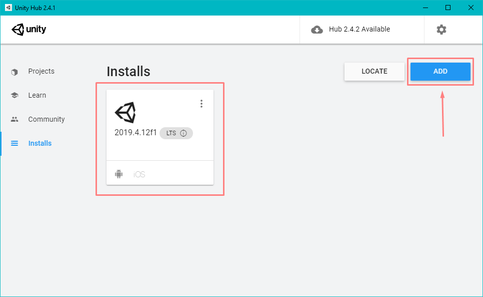

Next you will go to the projects tab and click "New" and select 3D Project. You can name the project whatever you'd like and make sure to select a Path for the project that you have access too. (i.e. C:/Users/\<Your User>/Documents/Unity Projects/).

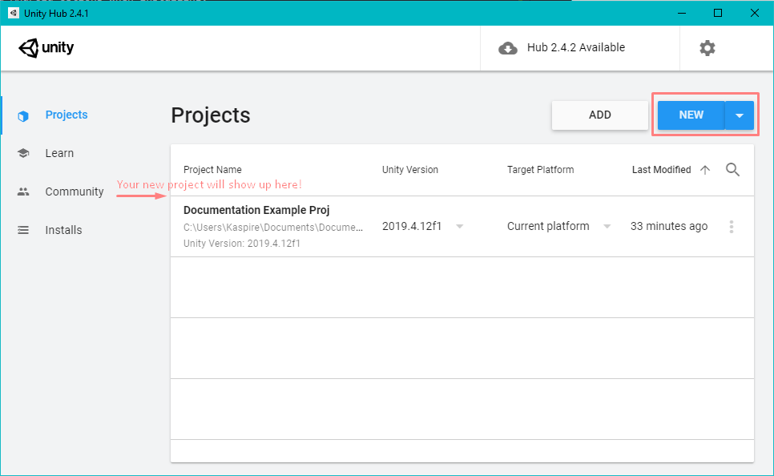

Once you have created your project you should be greeted with this screen:
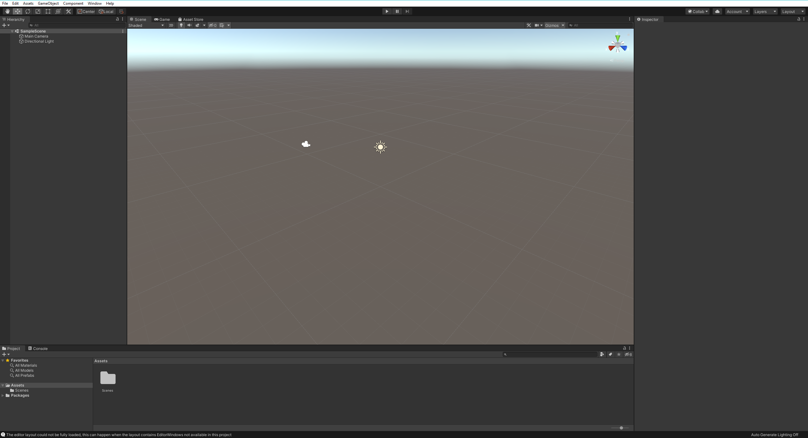

Next we need to add the Google Cardboard integration for our project.
We can do this by following [this](https://developers.google.com/cardboard/develop/unity/quickstart) link and following Google's directions very carefully!

We then need to add the GoogleVR SDK to our project.
Download the most recent version of the GoogleVRForUnity<version_number>.unitypackage file from this [this](https://github.com/googlevr/gvr-unity-sdk/releases) link and import it into Unity by clicking on the Assests menu at the top of the Unity screen and then selecting Import Package. You can then locate the file within your windows explorer and select it for import. 

After adding the Google Cardboard integration and the GoogleVR SDK to our project, there a few actions that we should take to be ready to build a project in VR. With exception of step 1, these steps should be followed for every scene you create in our project. 

1. HelloCardboard Scene Set Up 
NOTE: You can save this scene as any name you like. For example, we saved ours as Main Menu. For the sake of tutorial, we will refer to it as the HelloCardboard scene. 
With the HelloCardboard scene open, navigate to the CubeRoom Prefab in the hierarchy and select it. When the inspector opens on the right, locate, right-click on, and remove the CardboardStartup script. This script causes an error that Google has not yet resolved, and it is not needed for our project.
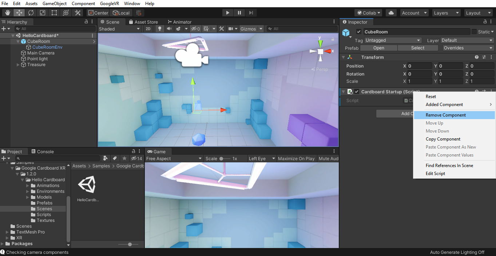
2. Camera Set Up 
If the camera present is listed as XRRig, skip to step B, otherwise, proceed to A.
- A. Select the camera from the hierarchy (it may be named camera or some variant of Main Camera), and in the inspector, name it Main Camera and set the tag to MainCamera. In the hierarchy, right click on the camera, select XR, and then select Convert Main Camera to XRRig. This is the camera preset that allows us to work in VR. 
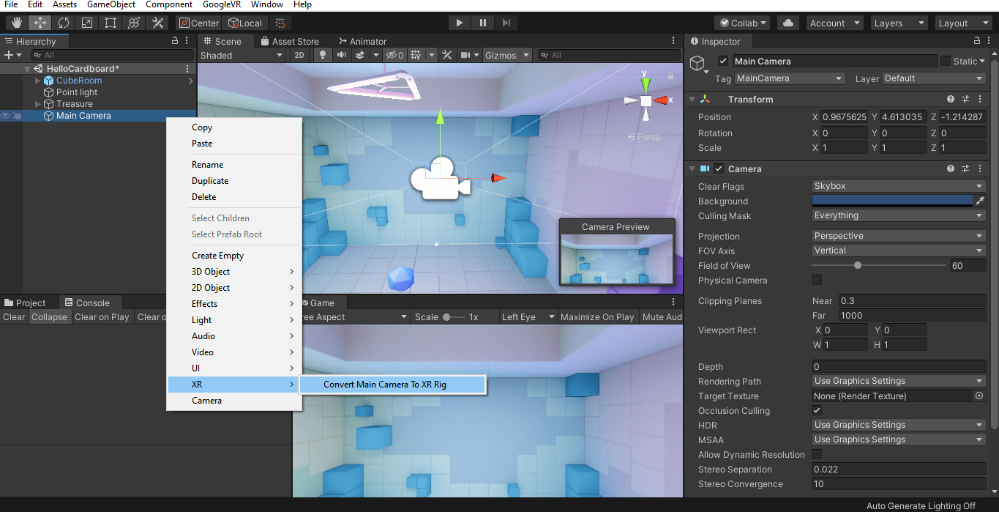
- B. Select the XRRig in the hierarchy. Camera position will be scene dependent and cannot be set universally; however, in the HelloCardboard scene, you can set the position to X: 0 Y: 2 and Z: 0 to get a good view. Next, the arrow beside the XRRig in the hierarchy should reveal it has two children: Camera Offset and Main Camera. Camera Offset does <b>NOT</b> need to be changed. Navigate to Main Camera, and in the inspector, change the near clipping plane to 0.09 and the far clipping plane to 50000.
 NOTE: When changing camera position, always change the position of the parent XRRig and <b>NOT</b> the children Camera Offset or Main Camera as they will move dynamically with the parent camera. 
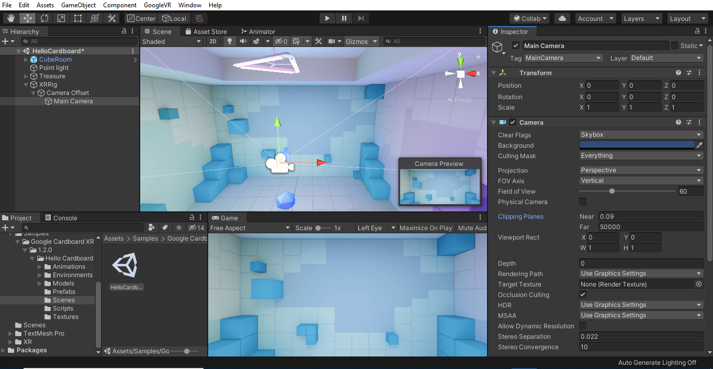
3. Reticle Set Up 
- A. Select the XRRig from the hierarchy, and in the inspector, select Add Component. From there, in the search bar type GvrPointerPhysicsRaycaster and select it to add it to the XRRig. This allows the reticle to be able to detect objects that it looks at. 
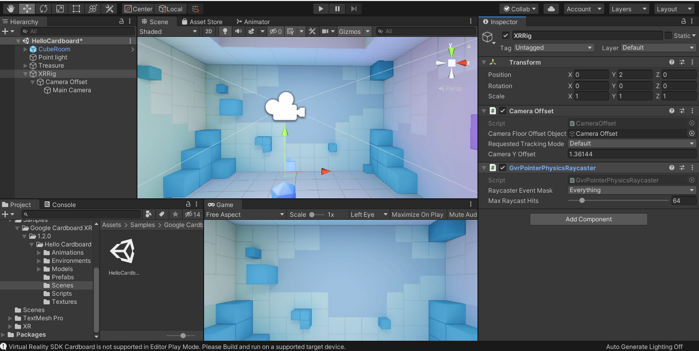
- B. From the project menu at the bottom left of the screen, in the search bar, type GvrReticlePointer. Drag and release the figure that looks like a cube (this is the symbol for a prefab) directly overtop of the Main Camera child of the XRRig. This will make the GvrReticlePointer a child of the Main Camera. Once complete, select the GvrReticlePointer from the hierarchy, and in the inspector, check the Draw Debug Rays box under the Gvr Reticle Pointer (Script) component. This will allow you to see where the reticle in pointing in the scene window as well as the game window when testing the game. 
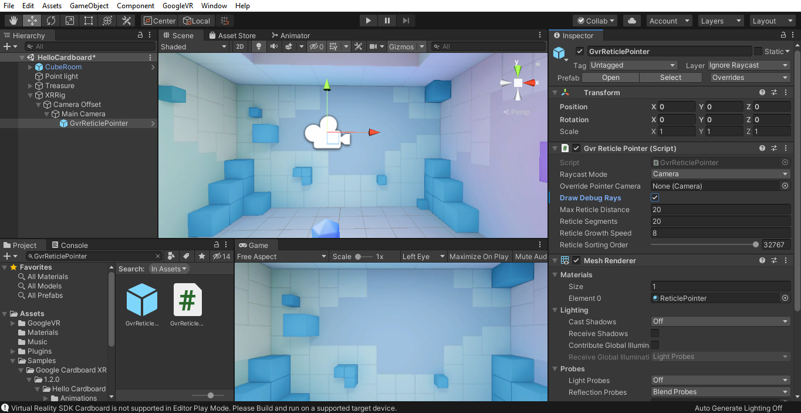
- C. From the project menu, type GvrEditorEmulator in the search bar and drag the prefab below everything else in the hierarchy. It should be a child of nothing but the scene itself. This will allow you to look around the scene when testing the project in the game window. The instructions for how to use this in the game window are listed in the inspector of the GvrEditorEmulator.
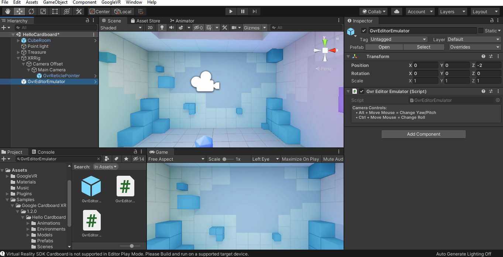
- D. From the project menu, type GvrEventSystem in the search bar and drag the prefab below everything else in the hierarchy. It should be a child of nothing but the scene itself. Select the GvrEventSystem in the hierarchy, and in the inspector, ensure that Vr Mode Only is <b>NOT</b> selected in the GvrPointerInputModule component. Then select Add Component, and from there, search for and add the Standalone Input Module component. Do <b>NOT</b> change any setting of the Standalone Input Module. The GvrEventSystem will allow the reticle to respond to any actions we apply to it such as clicking buttons.
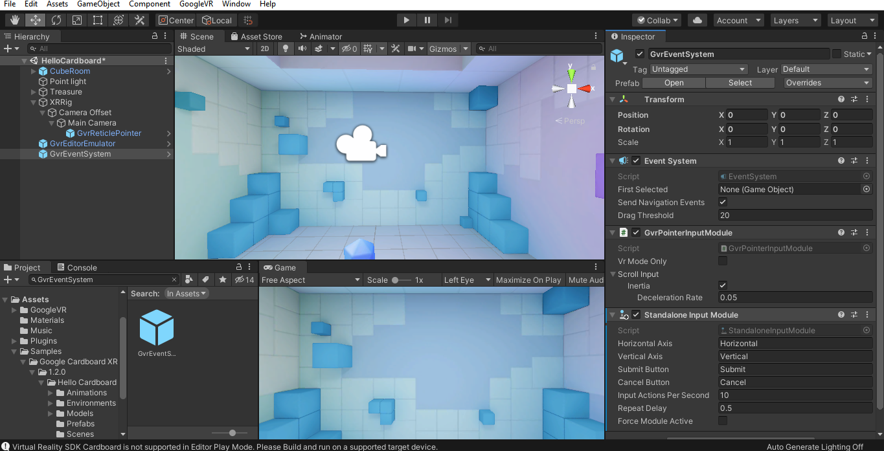

At this point, inital set up is complete, and you should be able to click the play button at the top of the screen. The game window will open and you will be able to look around and see the reticle in the HelloCardboard scene. To look around in the game window, refer to the instruction in the inspector of the GvrEditorEmulator prefab in the hierarchy. It is recommended you move the windows around so that you can see the scene window and game window at the same time, as in the screenshots, so that you can debug efficiently. Click the play button again to deselect it and go back to building. Test your project often to make sure individual components you add work! This makes errors easier to find in the future. This screenshot shows the game window working with the above setting configured. Notice the green debug ray in the scene window that matches where you are looking in the game screen.
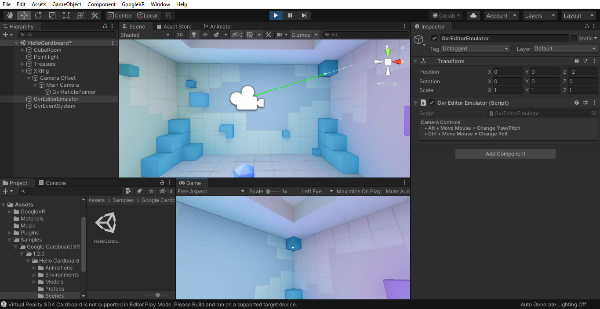

Once we have the project set up with all above settings then we are good to get started on making the Solar System.

---

## Blender

Blender is used to create the rings on Saturn as Unity doesn't have a built in model to create rings.

Once you download and install Blender, you'll be greeted with this screen:
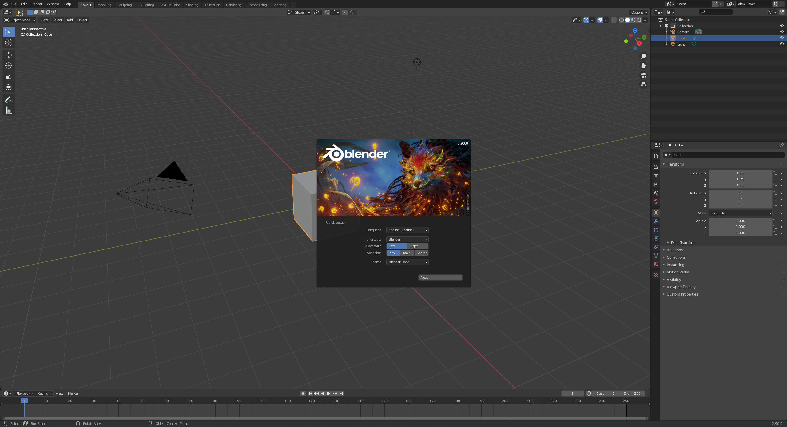

---

## Visual Studio/Code

Visual Studio and Visual Studio Code are both editors that can be used to write code for the Unity game engine.
- Visual Studio is a more official IDE and contains intellisense for Unity projects, but is heavy and may not run on low end hardware.
- Visual Studio Code is a more lightweight text editor that can function as a full blown IDE with some extra extensions installed.

Examples of both look like the below images after install:
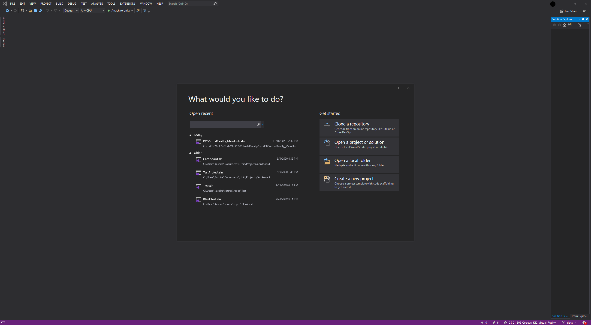
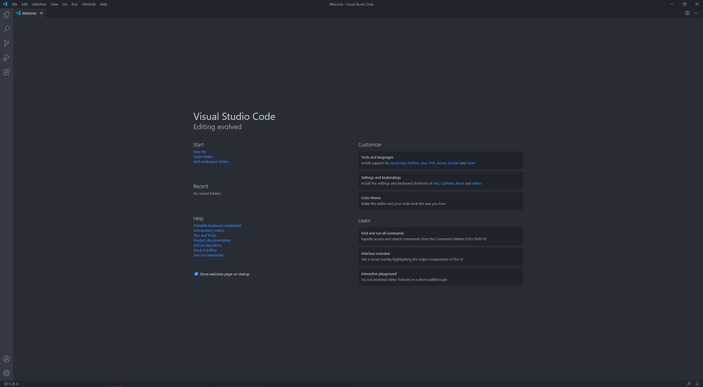

---

## Next Steps

