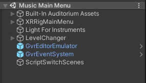

# Directions for Music Scene Set Up

## __NOTICE: This section assumes you have fully completed the General Setup and All Space Instructions.__

## Getting Started

After completing the General Set Up Instructions and the Space scene, you should have a general idea of how Unity works.  
We will now move forward to creating the Music scene, which provides a few extra challenges. The instructions will be more open ended from here to help teach you one of the most important things a programmer can learn: how to teach yourself. Don't be afraid to research things you don't understand at the moment; this is an important part of the learning process.  

To begin, we must acquire all assets required from the Unity Asset Store. For our case, it is better to use premade assets as creating these ourselves would be another project in itself.

Assets Used: 
- [Auditorium](https://assetstore.unity.com/packages/3d/environments/auditorium-141127) : All Auditorium Assets
- [Instruments](https://assetstore.unity.com/packages/3d/props/stylized-musical-instruments-pack-176502) : All instrument prefabs

Download and import these assets into Unity. If you have problems during importation, consult Unity documentation online.

<i>NOTE: These assets are not free. If free assets are needed, explore the Unity Asset Store and find suitable alternatives.  
The Auditorium asset is simply an environment to use; any free environment will work fine.  
The instruments were the most concise pack we could find; free instruments will work here as well.   </i>

## Seting Up the Environment

We will now set up the Auditorium Environment. If you used a different environment, tailor all instructions to fit your assets as best as possible. This leaves you room for creativity.

1. In the Project Window, find the Auditorium Asset Folder, find the Auditorium scene within, and press CTRL+D to duplicate it. This will create a new scene, Auditorium1. Change the name of Auditorium1 to Music Main Menu and open it.
2. In the Music Main Menu hierarchy, create an empty game object called Built-In Auditorium Assets and drag all existing elements in the hierarchy to be children of the Built-In Auditorium Assets object. This will us help clean up our hierarchy quite a bit. 
3. Follow General Set Up and Space Instructions to set up the camera, reticle, canvas UI, and scene changing script (You will not have a button to attach this script to yet.)  
<i> (Hint: You can copy and paste all of these elements in from the Main Menu Scene, change the UI as needed for the next instructions, and update the destination for the scene changing script in Unity when the time comes) </i>  
Position the XRRig camera in front of the stage in a way that looks pleasing to you. We used X: -0.3, Y: 0.5, and Z: 6.
4. To brighten up the stage a little, create a directional light above the middle of the stage and name it Light for Instruments. You shouldn't have to change any Inspector settings besides the X, Y, and Z location values.

5. Create an empty game object called Auditorium Audio. Create four empty game object children named AudioFrontLeft, AudioFrontRight, AudioMiddleLeft, and AudioMiddleRight and add an audio source component to each. Move each game object to be place over the Auditorium speaker for which it was named within the scene. For example, the AudioFrontLeft object goes over the speaker on the front left of the stage. For all audio sources, in the inspector, uncheck Loop, change the Spatial Blend to 3D, and set the Stereo Pan to either left or right depending on the game objects location in the scene with respect to the camera.

6. Using the existing SceneChanger game object, alter it so that only the button and black fade images remain under the canvas object. Move the button so that is it up against the back wall and facing the correct way. Change the text to "Exit" and set the button to work with the scene changing script and to go back to the Main Menu Scene when clicked. You can change the button color and text color to whatever you like; however, you <b>MUST</b> create a new material to use for the text color (just dupilcate and change the name of the existing one) or you will change the text color for everything in the project.

Your hierarchy should now look similar to this, though naming conventations may vary for the SceneChanger object and the switching scenes script object.  

7. Now make sure that we can reach the new scene we have created. Return to the Main Menu scene and add another button Under the Solar System Model button that says Instrument Guessing Game and set the button to change to the Music Main Menu Scene when clicked. You should now be able to navigate back and forth between the Main Menu and Music Main Menu scenes.

More will be added to the Auditorium as you progress through the project. Next, we need to add the instruments.

## Creating Instrument Prefabs
 We will now align each instrument correctly to work in the environment. Unfortunately, this will be the most tedious part of this project. We promise everything is fun after this so stick with it!
 
 1. In the Project Window, find the Instruments Asset Folder and open the Prefabs folder within. 
