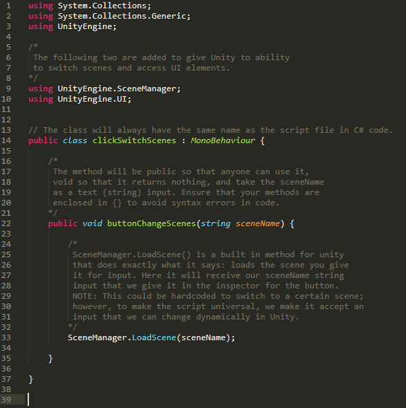
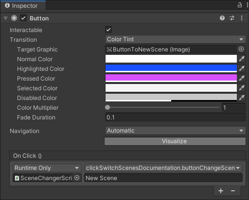
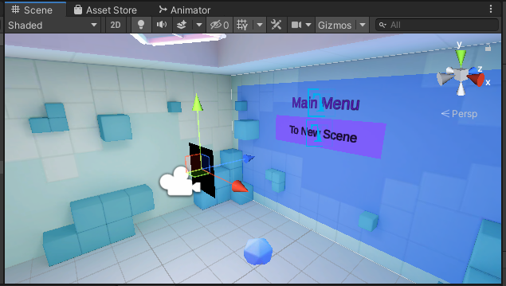
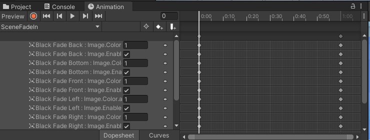

# Regular and Fading Animation Scene Transition
<b>NOTE: UI Creation instructions should be viewed before moving to this step. </b>

## Student Goals ##
- Learn the details involved in scene transition in Unity
- Perform a simple scene transition
- Perform a fading scene transition using an animation
- Generalize the transition to use in other instances in unity projects

### Instructions ###
Naviagate to the HelloCardboard scene with details from the Basic UI Creation instructions in place
#### Regular Scene Transition ####
1. With the HelloCardboard scene open, right click in the hierarchy and create an empty game object. This will be used to hold the script required to change scenes;
therefore, you should give it a name that will indicate its purpose. For example, SceneChangerScript. The position of the object does not matter as it is not a visual element.
2. In the inspector of the SceneChangerScript game object, click Add Component and select New Script from the menu. Give the script a fitting name such as ClickSwitchScenes,
then click Create and Add. 
3. Double click on the script in the inspector. This will open up the code for you to edit. Delete the default start() and update() methods as they are not needed for scene transition.

  A commented copy of the proper script is shown below:  

 Now lets make a scene to transition to in Unity. For the sake of this tutorial, we will just duplicate the currect scene and change a few details to prove this method works.

4. In the scenes folders in the project manager, select the HelloCardboard scene, and press ctrl+D to duplicate the scene. Select this new scene, and rename it to something else by right-clicking it and selecting Rename option from the menu that appears. 
5. Double-click on this scene to switch to it. With this scene open, press crtl+Shift+B to open the Build Settings for the project. Press the Add Open Scenes button to add the New Scene to the Build Settings. This will need to be done for every scene you add to unity projects. Then click the red X to return to the scene window. Do
<b>NOT</b> click the Build or Build and Run buttons as we are not compiling the entire project at this time.
6. To tell the difference between the New Scene and the HelloCardboard scene. Change the panel text in the New Scene from "Main Menu" to "New Scene" and change the button text from "To New Scene" to "To Main Menu". This will allow us to have confirmation that the scenes have been changed when we do so.
7. In the HelloCardboard scene, navigate the the button inspector and in the On Click() component, click the plus sign to add an action to the button. Drag the SceneChangerScript game object you created to the None (Object) bar in the On Click() component. From there, click the function drop down box and select the clickSwitchScenes script to access its methods. Select the buttonChangeScenes (string) method from the menu. In the box that appears, type the name of the scene
that you wish to switch to when you click the button, New Scene.

  The On Click() component should look similar to the following with slightly different naming conventions. 

8. Repeat step 7 in the New Scene scene and set it to change back to the HelloCardboard scene. 

  At this point you should be able to play the game and successfully switch between the two scenes. You will notice that currently the transition is a very sudden snap to the new scene. This can be very jarring for the user, especially in virtual reality. To get rid of this jarring effect, we will add some fading animations to the scenes.  

#### Fading Animation Scene Transition ####
1. In the project window, in the same area as the scenes folder, right-click and create an Animations folder. In this folder, create another folder with the name of the animation you will create, for example, SceneChanger. In this folder, right-click and select Create --> Animator Controller. Name the controller SceneChanger.
2. In the hierarchy of the HelloCardboard scene, create an empty game object named SceneChanger (the name of the controller for simplicity). Click and drag your Canvas to be a child of the SceneChanger game object. With the SceneChanger game object selected, go to the inspector, and add the Animator component. Drag the SceneChanger controller from the project window to the controller box in the inspector.

  The easiest way to fade in in Unity is to have a black image slowly changes its alpha value from 255 to 0 and vice versa for the fade out. In a traditional game, one image in front of the camera would suffice; however, in virtual reality, the user can look other places than directly in front of them. This means we will need to create a cube of images around the camera so that it fades no matter where the user is looking.  

3. In the hierarchy, under the Canvas object, add six images by right-clicking and selecting UI --> Image. Name them Black Fade Front, Black Fade Left, Black Fade Right, Black Fade Back, Black Fade Top, and Black Fade Bottom, respectively. These will be the sides of your cube.

4. Next, create an empty game object with the name Black Fades Images and drag all black fade images to be its children. Make sure the Black Fade Images game object is a child of the Canvas but not children of the panel or the button(s). With the Black Fade Images game object selected, set the position to X: 0, Y: 0, Z: 0, respectively. When you click any of the individual black fade images, in the inspector you will see a box with a check mark in it beside the image component. This is to turn images on/off. Turn all images off execpt Black Fade Front. This will help us focus on one image at a time.

5. With the Black Fade Front image selected and on, set position to X: 0, Y: 0, Z: 0, Width: 1, and Height: 1. Set the color to black, and make sure Raycast Target and Maskable are checked.

6. Repeat step 5 with the remaining five images, and change their position and rotation values to move them to their respective locations to form a cube around the camera.

  With only the Black Fade Front turned on, it will look like the image below.  

  Now we are ready to start animating!  

7. Select the SceneChanger game object and press ctrl+6. This will bring up the animating window (You can click and drag the animating window beside the project and console windows for ease of access). Select the drop down arrow and select create new clip. Save it as SceneFadeIn.anim.

8. With SceneFadeIn selected from the drop down menu, press the record button. Click the Black Fade Front image, and in the inspector, turn it on and set the alpha value to 255 by selecting the color and dragging the A slider. Repeat this step for the remaining images. Do <b>NOT</b> stop recording; however, if you do, you can simply hit the record button again. You will not lose your progress.

 <i>Note: You may have to turn the image off and on again and move the alpha from 255 back to 255 if these settings were already in place. You will know you did it correctly if the options you have selected appear in the animation window. </i> 

9. Still recording, drag the vertical white bar in the animation window to the 1:00 second mark; you may have to zoom out within the window to see it. Select the Black Fade Front Image and turn the image off and set the alpha to 0. Do the same for the remaining images, and then stop recording by pressing the record button, again. You should be able to play your animation in the animation window and see it work now.

  Your animation window should look similar to the following image  

