# Directions for Space scene

# NOTICE** This section assumes you have fully completed the Setup Instructions.

## Getting Started

Once you've followed the instructions from the Setup_Instructions document and have installed the software, next you need to download some textures in preparation for the creation of the planets.

- [Textures](https://www.solarsystemscope.com/textures/) : Textures for each of the celestial bodies we'll be creating.
- [Moon](https://svs.gsfc.nasa.gov/4720) : Texture for the moon.
- [Pluto](http://planetpixelemporium.com/pluto.html) - Texture for pluto.

# Creating a Star!

In order to create the solar system we will need to create our star, the sun! From the blank scene in the project you've created after 'Setup Instructions' we will first clear the scene.

## 1. Right click Directional Light > Delete.

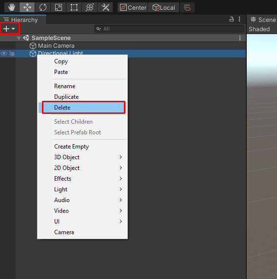

## 2. Click the + icon under 'Hierarchy' > Select 3D Object > Select Sphere

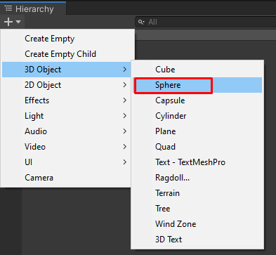

Make sure that the sphere is located at (0, 0, 0) and set the scale to an arbitrarily large number, for this example we will pick (4000, 4000, 4000).

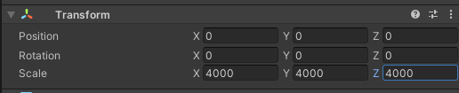

You may have to zoom out using the scroll wheel to see the entirety of the sun. It is very large now.

## 3. Creating the material!

Now that we have a sphere, we need to create a new material from our sun texture we downloaded.

Right click the Assets panel > Select 'Create' > Select 'Material' > Name it "Sun_Material"

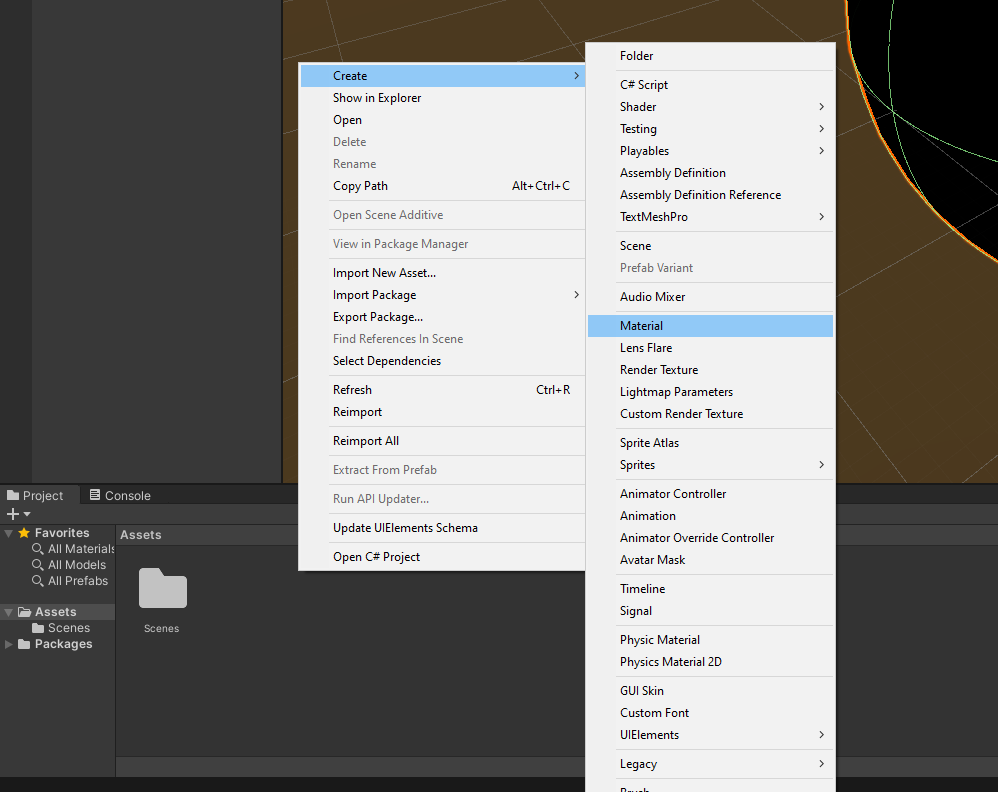

Now that we have the material created, we want to add the texture that we downloaded for the sun and set the Material's Albedo to that texture. In order to do that, click and drag the texture from the Assets panel into the small Albedo box within the Sun_Material under the 'Inspector' panel on the right side of Unity.

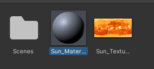
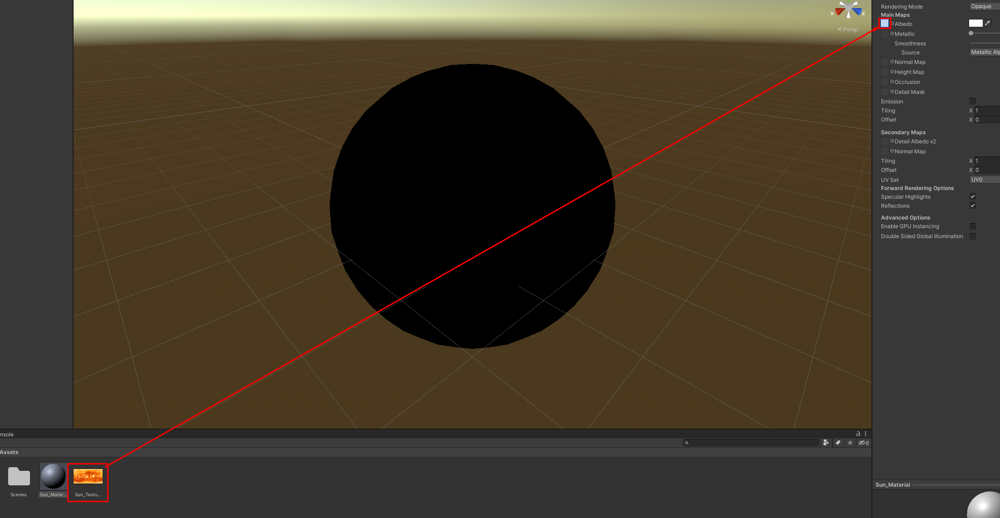

The Inspector for our material should look like this now:

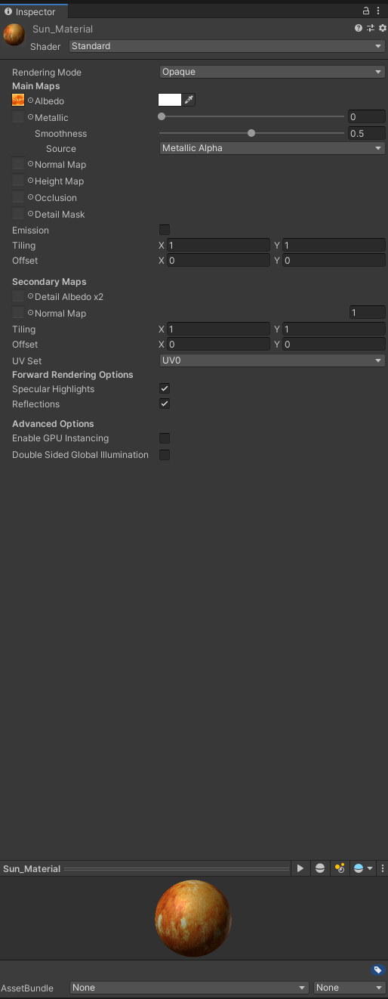

Finally we can click and drag our material onto our sphere in the Scene itself to apply our material.

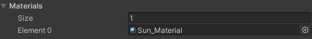

But wait! We've applied the material but our sphere is still black! Why is that? Well, remember when we deleted the Directional Light from the scene? That is why our sphere is still dark. We can fix this though by allowing our material we created to emit light by itself. This light won't impact the rest of the scene, but it will allow the texture to be visible.

To do this, select our material again and check the box next to 'Emission.' Then drag the sun texture into the little box next to Color. This will give the most accurate color profile for the light emission for our material.

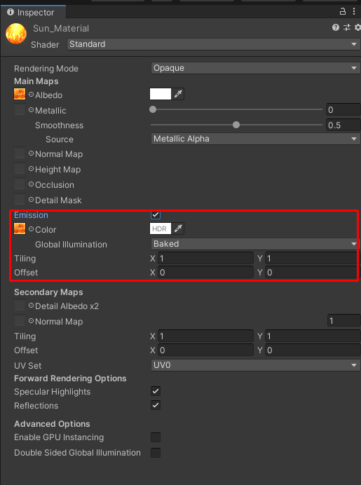
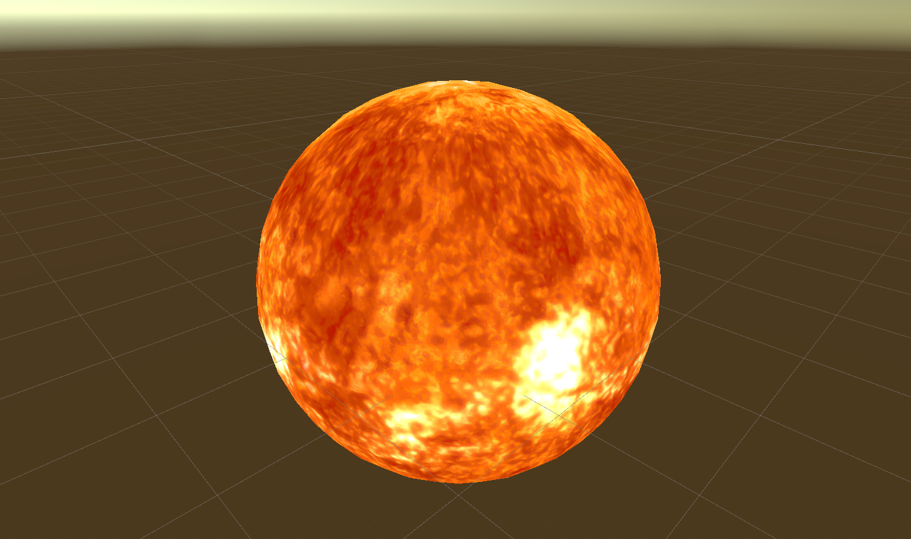

At last, our sun is now visible! As a last step, you can right click the Sphere object in the 'Hierarchy' to rename it to "Sun" for proper clarification.

# Creating a Galaxy!

Now that we have a sun, it looks out of place with the standard unity backdrop. What we need is a sweet space texture for our skybox background!

This will be similar to creating our sun. First we need to create a new Material and name it "Skybox".

After creating a new material, select the Skybox option in the dropdown menu under our 'Inspector' and select '6 Sided' for the type of skybox.

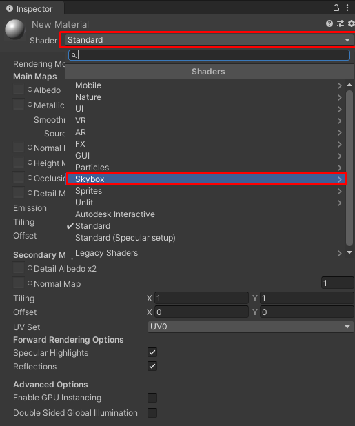

Next, click and drag our galaxy/space/stars texture into each of the 6 sides of our material.

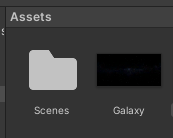

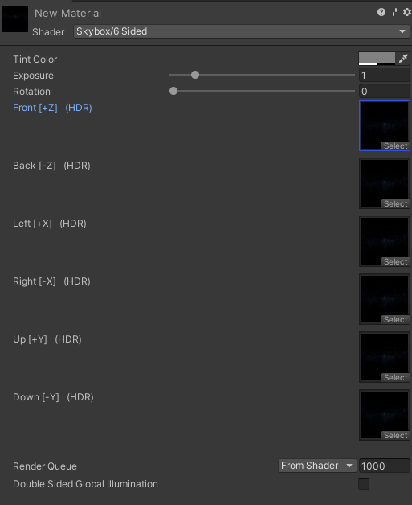

Last but not least, click and drag our new material into the Scene and drop it on the background! As you can see, our sun is now in a galaxy of other stars!

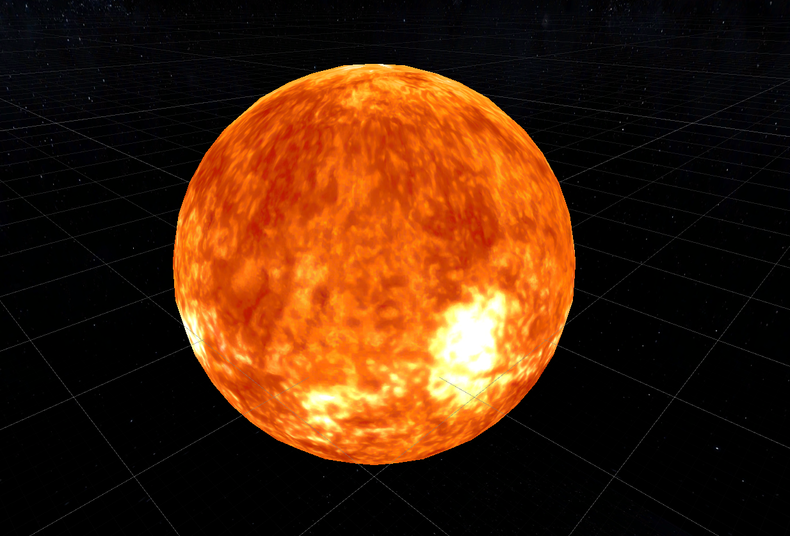

# Making our sun bright!

In order for our sun to emit light like a real star, we have to do something sneaky. Our 3D Sphere can't emit light on its own, so we have to create a point light and place it in the center of our star at (0, 0, 0). This will make it seem like our sun is actually emitting light when it really isn't.

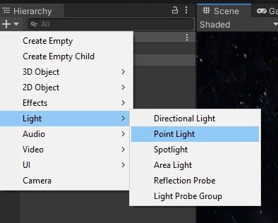

Now that we have our point light, we need to make sure it is in the position (0, 0, 0). After that we need to make sure it will reach the ends of our solar system. To do that we will set the range of our point light to an arbitrarily large number, for now we will pick 30,000.

Finally in order to increase the brightness of our star's light, we will increase the intensity to two.

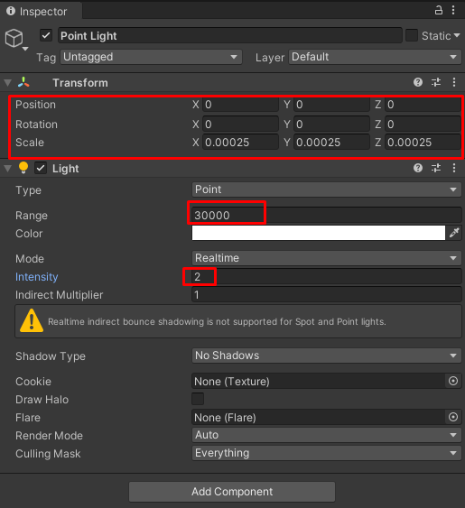

In order to keep organized, we can click and drag our point light directly onto our Sun under our 'Hierarchy.' This will make the point light a child of our Sun object.

The final product for our point light should be as follows:

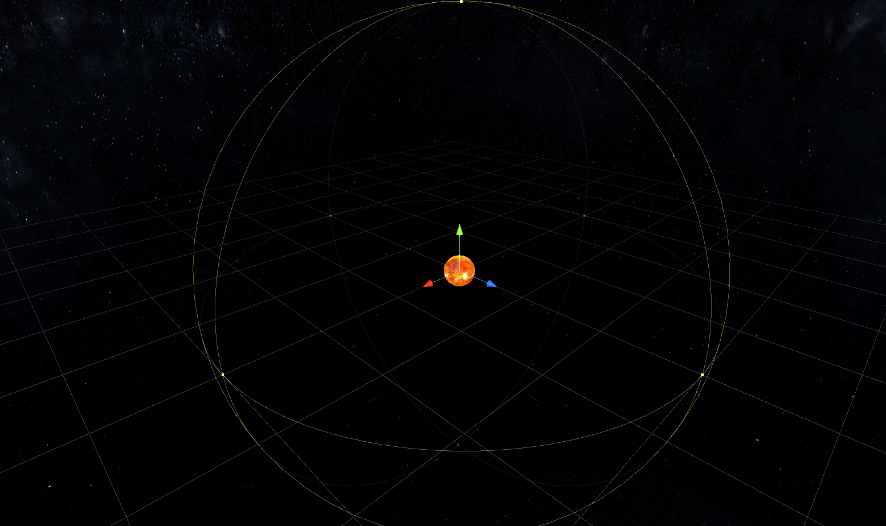

From now on, whenever you add another object to the scene, it will appear as if our Sun object is illuminating it.

# Creating Planets!

Creating planets is basically the exact same thing as creating the sun, just with different Positions and Scales relative to the center of the solar system.

This part is up to you. Now that you know how to create a 3D sphere object and create a meterial for that object. you can create as many planets and stars as you'd like.

Two paths:

1) Create your own solar system! Have one, two or even three suns! Create as many wild and wacky planets as you'd like!
2) Create an accurate representation of our current real life solar system!

If you ever get stuck, just go back to the previous sections to help you out! :)

# Creating Rings Like On Saturn!

[Old but useful video for reference.](https://www.youtube.com/watch?v=HM6TaDdM63k)

Now after you've taken some time to create some extra planets and the like, maybe you would like to add Rings to your planet or star, just like Saturn. 

Unity doesn't have any prefab for a set of rings, so we will have to create them in Blender and then import them into our project in Unity!

Steps to create rings:

1) Delete default cube in blender
2) Press NUMPAD-7 to look in Top View
3) Press Shift-A > Mesh > Circle
4) Press Tab to enter edit mode and see vertices
5) Press E to enter Extrude mode
6) Press S to extrude inward and move mosue toward center of circle to create the hole size of your choosing
7) Left click once your selection is done
8) Add a Subdivision Surface modifier so that the texture in unity will adhere

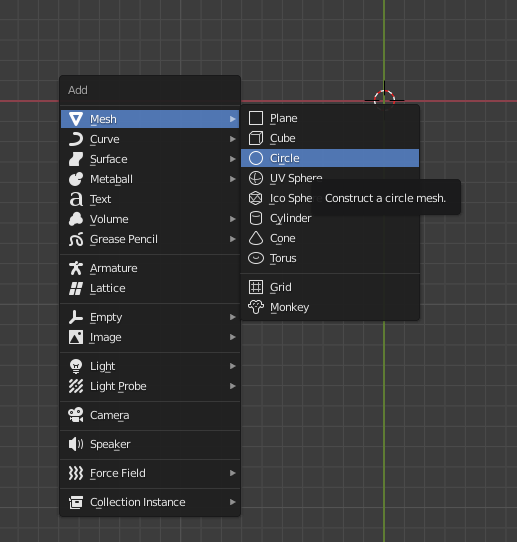

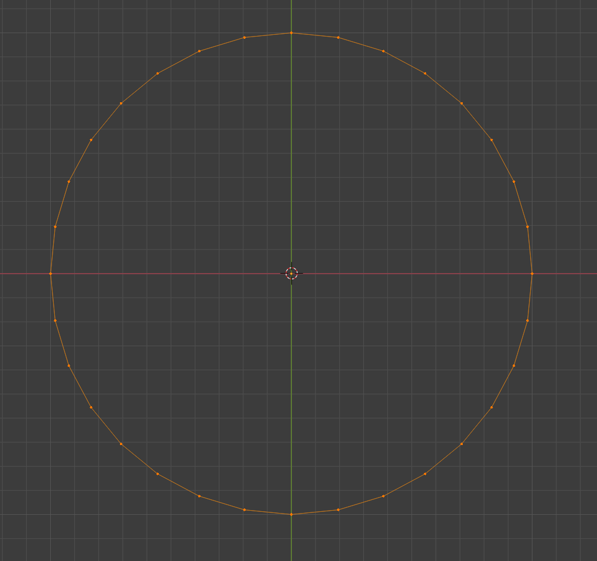

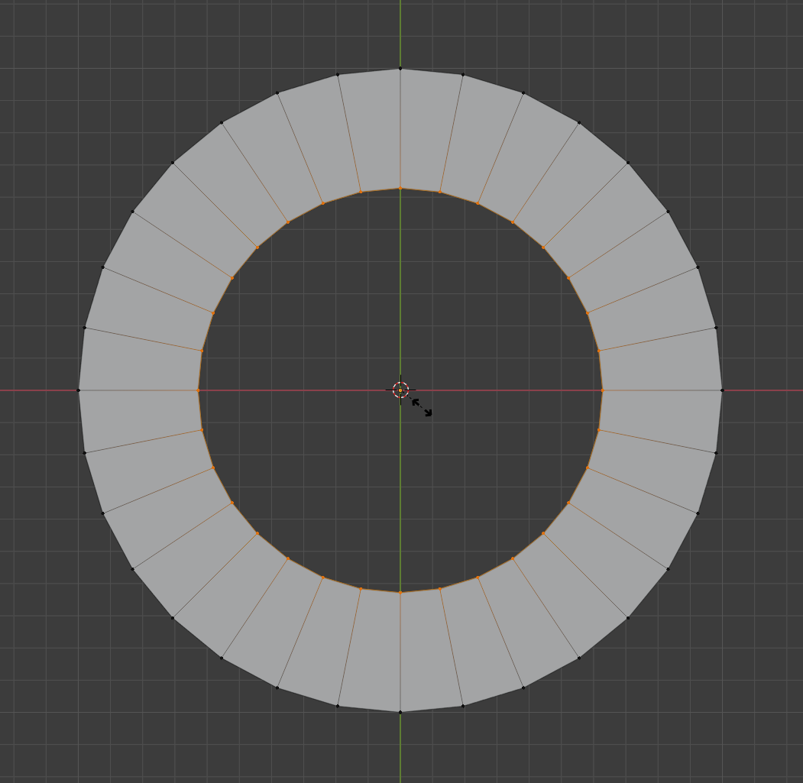

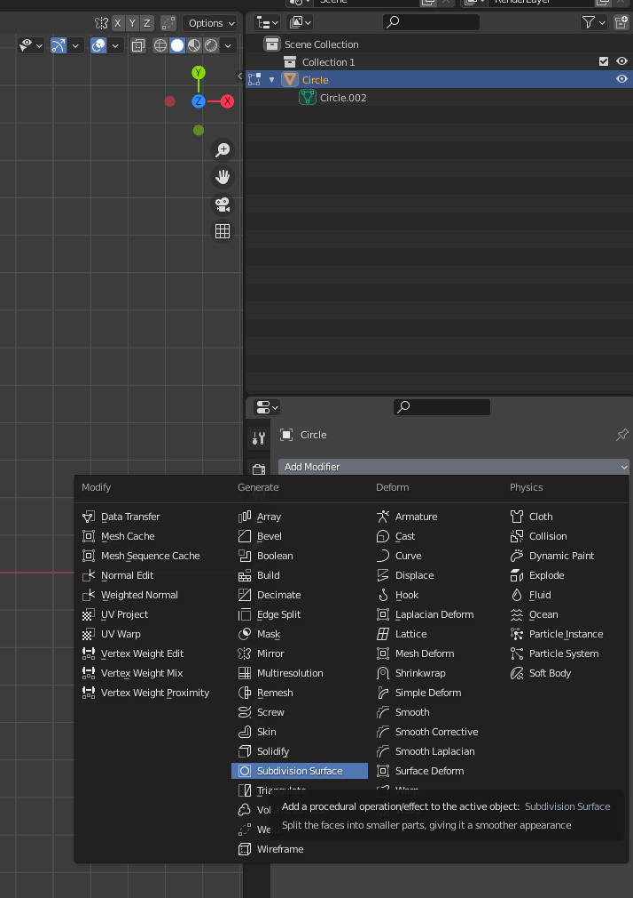

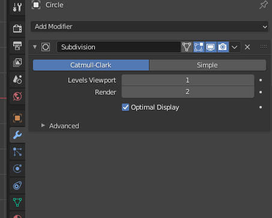

Now all you need to do is save your rings as a .blend file into the Assets directory of your project. Unity will do the rest in terms of importing the model into the engine.

Once it is in unity, you can click and drag the file into the Scene and your rings should show up! You may have to rotate it and scale it to see the side that is visible though!

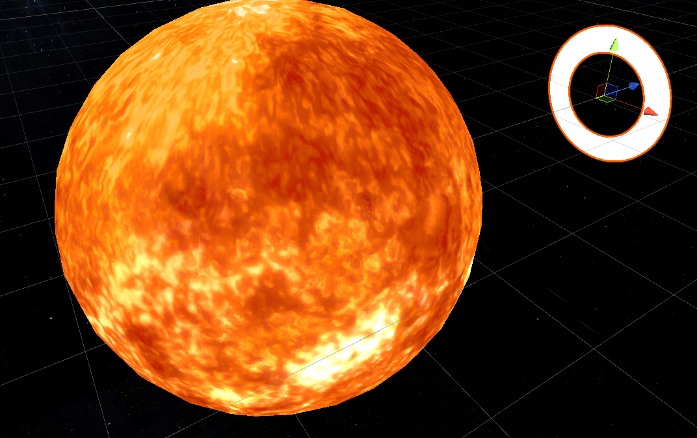

# Adding VR

One more thing we have to do in order for our project to run on a Google Cardboard VR Device! We need to change our Main Camera to an XR Rig from Google. Luckily the google cardboard plugin allows us to do that very easily. All we have to do is right click our Main Camera, select XR and Convert!

This is your new XR Rig, so feel free to set the position, rotation and scale of the Rig to whatever fits your needs.

If you need to edit the Camera directly then you can still do so, it is under the XR Rig in the Hierarchy. But only do this if you REALLY need to, editing the camera and not the rig can cause things to get messed up! (i.e. setting the position/rotation for the camera inside the rig will cause the rig to do some weird unwanted behavior)

# Where to go from here?

Once you have created all the models you want for your solar system, the next challenges are rotation and revolution. If you look at our implementation of the project, you will notice a couple of scripts called Rotation and Revolution. These can be added to your objects and cause them to move dynamically when you press play on the editor. It is a good idea to look at our code to see how it works and then modify it for your own interests. All the code we've used is commented and documented so that you can understand what each line of code is doing.

Make things as fast or slow as you'd like; as wild and crazy as you'd like. Scripts can be created just like how you create a material only selecting 'C# Script' in the menu as opposed to Material.

We leave the rest of the project to you as a challenge to your own ability and creativity! I hope you have a great time messing around with things! It's one of the best ways to learn programming!